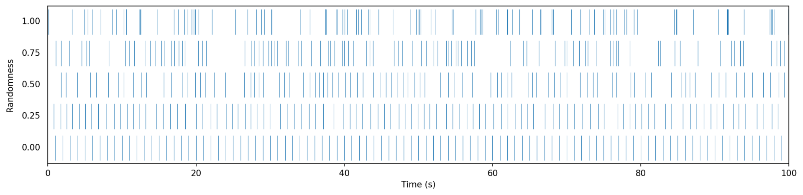

.. include:: defs.hrst

Metronome
=========

A digital source unit that emits a pulse at a regular pace. It is conceptually similar to an
:doc:`Alarm` that automatically restarts after each trigger. Metronomes are ideal for
**triggering periodic events** in interactive systems, such as blinking LEDs, synchronizing motor
movements, or scheduling actions at regular intervals.  Each time the metronome "ticks," it
evaluates to ``true`` for a single frame, and ``false`` otherwise.

Parameters
----------

- **period()**: Sets the duration of one cycle in seconds.
- **frequency()**: Alternative to period, sets the rate in cycles per second (Hz).
- **bpm()**: Another convenience method to set the frequency using beats per minute (BPM).
- **phase()**: Sets the initial offset within the cycle (in range [0,1]).

Randomization
-------------

Metronomes can also be used to generated **randomozed patterns** using the ``randomize()`` function.
This makes their ticks feel less mechanical and closer to natural rhythms such as raindrops falling,
typing on a keyboard, or the reactions of a living entity. When activating randomization, the metronome does
not trigger at perfectly regular intervals anymore. Instead, the length of each cycle is perturbed according
to the chosen randomness level. At low values (close to 0), the timing remains close to steady with
gentle variation. At high values (close to 1), the ticks may cluster together or leave longer pauses, while
still averaging the correct period over time. This means that even with randomness, the metronome respects
its ``period`` setting in the long run, but the *spacing* between individual ticks is altered.

This graph shows the effect of different randomization levels on event triggers (all metronomes have a
one-second period):

Basic Example
-------------

The simplest use of a metronome is to trigger an LED blink every 0.5 seconds:

.. code-block:: c++

   #include <Plaquette.h>

   Metronome myMetro(0.5); // tick every 0.5 seconds
   DigitalOut led(13);

   void begin() {}

   void step() {
     if (myMetro) {
       led.toggle();
     }
   }

Multiple Metronomes
-------------------

You can run several metronomes in parallel to control independent events:

.. code-block:: c++

   #include <Plaquette.h>

   DigitalOut led(LED_BUILTIN);
   Metronome metroFast(0.5);   // Blink at 2 Hz
   Metronome metroSlow(2.0);   // Trigger every 2 seconds

   void step() {
     if (metroFast) led.toggle();
     if (metroSlow) Serial.println("Tick!");
   }

.. _metronome-randomization:

Randomized Metronome
--------------------

The following sketch blinks the LED at an *average* rate of once per second, but
with irregular spacing:

.. code-block:: c++

   #include <Plaquette.h>

   DigitalOut led(13);
   Metronome metro(1.0); // base period of 1 second

   void begin() {
     metro.randomize(); // 100% randomness (default)
   }

   void step() {
     if (metro) {
       led.toggle();
     }
   }

|Reference|
-----------

.. doxygenclass:: Metronome
   :project: Plaquette
   :members:

|SeeAlso|
---------
- :doc:`Alarm`
- :doc:`Chronometer`
- :doc:`Ramp`
- :doc:`Wave`
