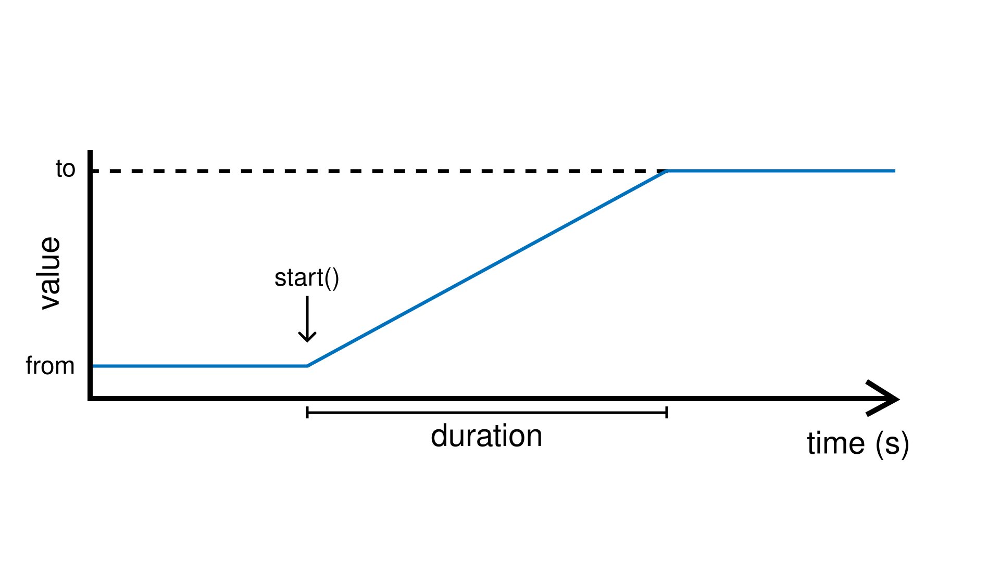
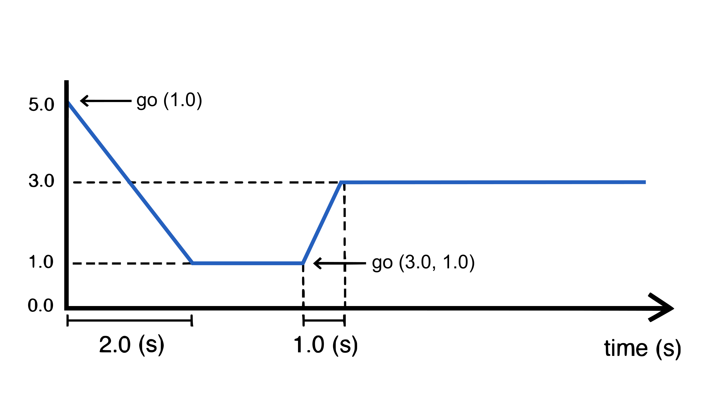

.. include:: defs.hrst

Ramp
====

A source unit that generates a smooth transition between a starting value and an ending
value over a given duration. The transition begins when ``start()`` is called, and the
ramp's current value can be read or piped to an output at any time.

Parameters
----------

.. list-table::
   :header-rows: 1
   :widths: 12 33 9 16 15 15

   * - Name
     - Description
     - Range
     - Setter
     - Getter
     - Flow
   * - duration
     - Duration of the ramp transition (in seconds).
     - > 0
     - ``duration(v)``
     - ``duration()``
     - ``Duration()``
   * - speed
     - Rate of change (change-per-second).
     - > 0
     - ``speed(v)``
     - ``speed()``
     - ``Speed()``

Events
------

.. list-table::
   :header-rows: 1
   :widths: 50 25 25

   * - When
     - Trigger
     - Callback
   * - Timed process completes
     - ``finished()``
     - ``onFinish(c)``

Basic Usage
-----------

A ramp is defined by three values:

 * ``from()`` is the value at which the ramp starts (default: 0)
 * ``to()`` is the value where the ramp ends (default: 1)
 * ``duration()`` is the duration the ramp takes to go from ``from`` to ``to``

It can then be started by calling the ``start()`` function.

.. tip::

  As an alternative to ``duration``, one can use the ``speed`` parameter instead to
  specify transition time in values-per-seconds. This is useful when we want to maintain
  a stable rate of change when the ``from`` and ``to`` values change, such as when
  controlling servo-motors.

|Example|
---------

Pressing a button below triggers a two-second fade from off to full brightness:

.. code-block:: c++

   #include <Plaquette.h>

   Ramp fader(2.0); // 2-second ramp, from 0 to 1 by default

   AnalogOut led(9);
   DigitalIn button(2, INTERNAL_PULLUP);

   void step() {
     // Press button to trigger the fade.
     if (button.rose())
       fader.start();

     // Flow ramp value to LED.
     fader >> led;
   }

Easing
------

Ramps support easing functions to shape the transition curve for more expressive effects.
Passing an easing function to ``easing()`` applies it to all subsequent transitions.

Please refer to :doc:`this page <easings>` for a full list of available easing functions.

Starting from the example above, add the following ``begin()`` function to specify an
easing function. Easting ``easeInSine`` makes the fade start slowly and accelerate.

.. code-block:: c++

   void begin() {
     fader.easing(easeInSine); // slow start, accelerating towards the end
   }

Changing End Points
-------------------

The starting value (``from``) and ending value (``to``) can be changed to produce
different transitions. Setting ``from`` to 1.0 and ``to`` to 0.0 reverses the direction,
fading the LED from full brightness down to off:

.. code-block:: c++

   void begin() {
     fader.fromTo(1.0, 0.0); // changes both from (1.0) and to (0.0)
   }

Values do not need to stay withing [0, 1], they can take any values.

|Example|
---------

This example uses a metronome to trigger a ramp. The ramp controls the frequency
of a blinking LED.

.. code-block:: c++

   #include <Plaquette.h>

   Ramp fader(5.0); // 5-second ramp

   Wave wave(SQUARE); // square wave
   DigitalOut led(13); // blinking LED

   Metronome metro(7.5); // 7.5-second metro

   void begin() {
     fader.fromTo(2, 10); // ramp from 2 Hz to 10 Hz
   }

   void step() {
     // Metronome triggers the ramp.
     if (metro)
       fader.start();

     // Flow ramp value wave frequency.
     fader >> wave.Frequency();

     // Blink LED.
     wave >> led;
   }

The go() Function
-----------------

The ``go()`` function provides a simple way to immediately launch a ramp from the current value to another,
or simply from the current value towards a new goal. It sets ``to`` and ``duration`` or ``speed`` in a single
call and immediately starts the transition from the current value.

The two main forms are:

* ``go(to)``: transition from the ramp's current value to ``to`` using the current duration or speed.
* ``go(to, durationOrSpeed)``: transition from the ramp's current value to ``to`` in ``duration`` seconds
  OR ``speed``, depending on the current mode

.. tip::

  An optional easing function can be passed as the last argument of any ``go()`` call. For example,
  ``go(2.0, easeInSine)`` and ``go(2.0, 3.0, easeInSine)`` go to value 2.0 using easing function ``easeInSine``
  (3.0 is the value of duration or speed in the second version).

The following diagram shows what happens to a ramp signal:
 * Initially the ramp is at value 5.0 with duration of 2.0 seconds.
 * Calling ``go(1.0)`` starts a ramp from 5.0 to 1.0, using current duration of 2.0 seconds.
 * Later, calling ``go(3.0, 1.0)`` starts ramping from current value to value 3.0, overriding duration with a 1.0 second duration.

|Example|
---------

The example below uses ``go()`` to create a continuous random walk, chaining from the
current value to a new random target each time the previous transition completes. It uses
speed instead of duration.

.. code-block:: c++

   #include <Plaquette.h>

   Ramp zigZagRamp;

   Plotter plotter(115200);

   void begin() {
     // Set speed to 1.0 per second.
     zigZagRamp.speed(1.0);
     // Apply an easing function (optional).
     zigZagRamp.easing(easeOutSine);
     // Go from zero (initial value) to a random value.
     zigZagRamp.go( randomFloat(-10.0, 10.0) );
   }

   void step() {
     if (zigZagRamp.finished()) // event: ramp finished
     {
       // Ramp from current value to new random value, increasing speed by 1 each time.
       zigZagRamp.go(zigZagRamp + randomFloat(-10.0, 10.0), zigZagRamp.speed() + 1);
     }

     // Send ramp value to plotter for visualization.
     zigZagRamp >> plotter;
   }

Ramp as a Timer
---------------

A ramp can be used as a timer (like an analog version of :doc:`Alarm`). By default, ramp goes from 0 to 1
(0% to 100%) over a given duration. The ramp can thus be used as a measure of progress over time. The example
below uses the ramp value to cycle through four phases, changing the frequency of a LED pulse at each transition:

.. code-block:: c++

   #include <Plaquette.h>

   // Ramp over 5 seconds. Default ramp always runs from 0 to 1.
   Ramp timer(5.0);

   // Square wave oscillator driving the LED.
   Wave pulse(SQUARE);

   // Built-in LED.
   DigitalOut led(LED_BUILTIN);

   void begin() {
     timer.start(); // start the timer
   }

   void step() {
     // Change wave frequency based on progress thresholds.
     if (timer < 0.25) {
       pulse.frequency(0.5);  // slow pulse: warming up
     }
     else if (timer < 0.5) {
       pulse.frequency(3.0);  // fast pulse: running
     }
     else if (timer < 0.75) {
       pulse.frequency(1.0);  // medium pulse: cooling down
     }
     else {
       pulse.frequency(0.25); // very slow pulse: standby
     }

     // Flow wave to LED.
     pulse >> led;

     // Restart the timer when it completes, increasing duration each time.
     if (timer.finished()) {
       timer.duration( timer.duration() + 5 );
       timer.start();
     }
   }

|Reference|
-----------

.. doxygenclass:: Ramp
   :project: Plaquette
   :members:

|SeeAlso|
---------
- :doc:`Alarm`
- :doc:`Chronometer`
- :doc:`easings`
- :doc:`Metronome`
- :doc:`Wave`
