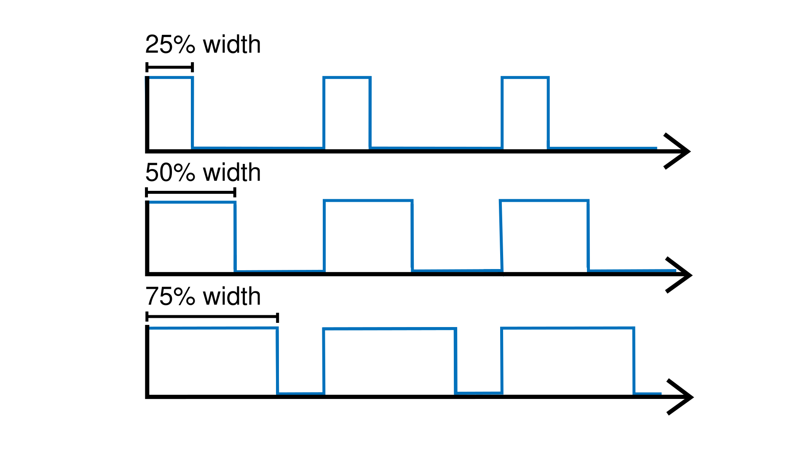

.. include:: defs.hrst

SquareWave
==========

A source unit that generates a `square wave <https://en.wikipedia.org/wiki/Square_wave>`_
signal. The signal can be tuned by adjusting parameters such as ``period``, ``frequency``,
``amplitude``, or ``skew``.

.. image:: images/Plaquette-SquareWave.png

The ``skew`` represents the proportion of time (expressed as a percentage) in each
cycle (period) during which the wave is "on" -- in other words, its *duty cycle*.

|Example|
---------

Makes the built-in LED blink with a period of 4 seconds. Because the duty cycle
is set to 25%, the LED will stay on for 1 second and then off for 3 seconds.

.. code-block:: c++

   #include <Plaquette.h>

   DigitalOut led(13);

   SquareWave blinkOsc(4.0);

   void begin() {
     blinkOsc.skew(0.25); // Sets the duty cycle to 25%
   }

   void step() {
     blinkOsc >> led;
   }

.. doxygenclass:: SquareWave
   :project: Plaquette
   :members: SquareWave, get, period, frequency, skew, phase, amplitude, bpm, mapTo, forward, reverse, toggleReverse, shiftBy, shiftByIsOn, atPhase, atPhaseIsOn, start, stop, pause, resume, isRunning, addTime, setTime

|SeeAlso|
---------
- :doc:`SineWave`
- :doc:`TriangleWave`
