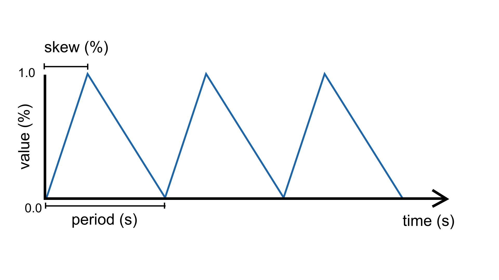
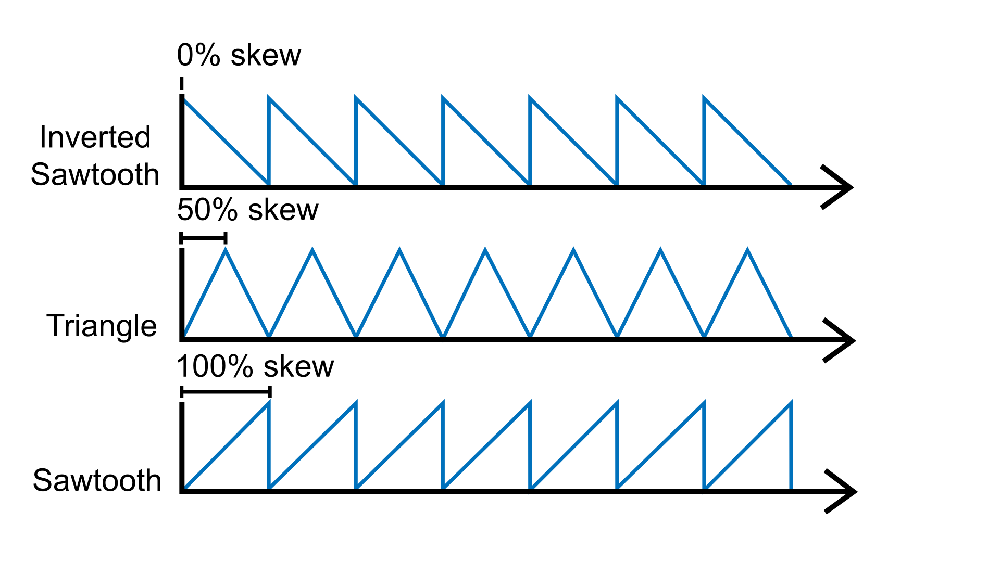

.. include:: defs.hrst

TriangleWave
============

A source unit that can generate a range of triangle-shaped signals such as the
`triangle wave <https://en.wikipedia.org/wiki/Triangle_wave>`_ and the
`sawtooth wave <https://en.wikipedia.org/wiki/Sawtooth_wave>`_.  The signal can
be tuned by adjusting parameters such as ``period``, ``frequency``, ``amplitude``,
or ``skew``.

The ``skew`` parameter represents the "turning point" during the period at which
the signals reaches its maximum and starts going down again. Changing the skew
allows to generate different kinds of triangular-shaped waves. For example, by
setting skew to 1.0 (100%) one obtains a *sawtooth* wave; by setting it to 0.0 (0%)
an *inverted sawtooth* is created; anything in between generates different flavors
of *triangle* waves.

|Example|
---------

Controls a set of traffic lights that go: red, yellow, green, red, yellow,
green, and so on. It uses a sawtooth to iterate through these three states.

.. code-block:: c++

   #include <Plaquette.h>

   DigitalOut green(10);
   DigitalOut yellow(11);
   DigitalOut red(12);

   TriangleWave osc(10.0);

   void begin() {
     osc.skew(1.0); // sawtooth wave
   }

   void step() {
     // Shut down all lights.
     0 >> led >> yellow >> green;
     // Switch appropriate LED.
     if (osc < 0.4)
       green.on();
     else if (osc < 0.6)
       yellow.on();
     else
       red.on();
   }

.. doxygenclass:: TriangleWave
   :project: Plaquette
   :members:

|SeeAlso|
---------
- :doc:`Ramp`
- :doc:`SineWave`
- :doc:`SquareWave`
