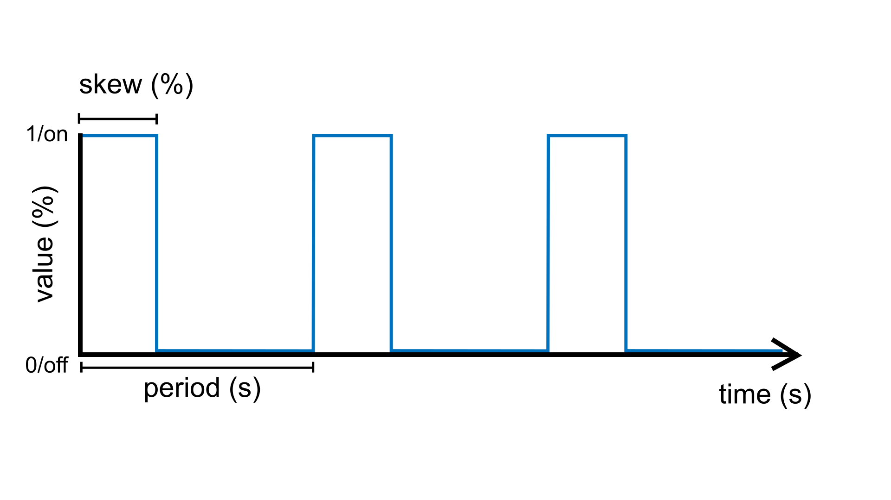
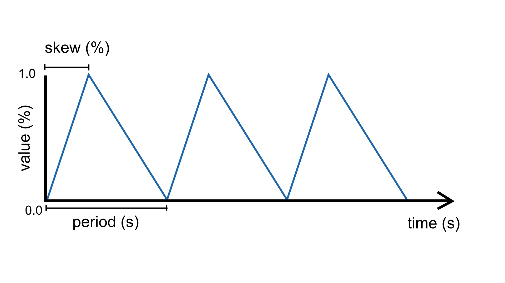
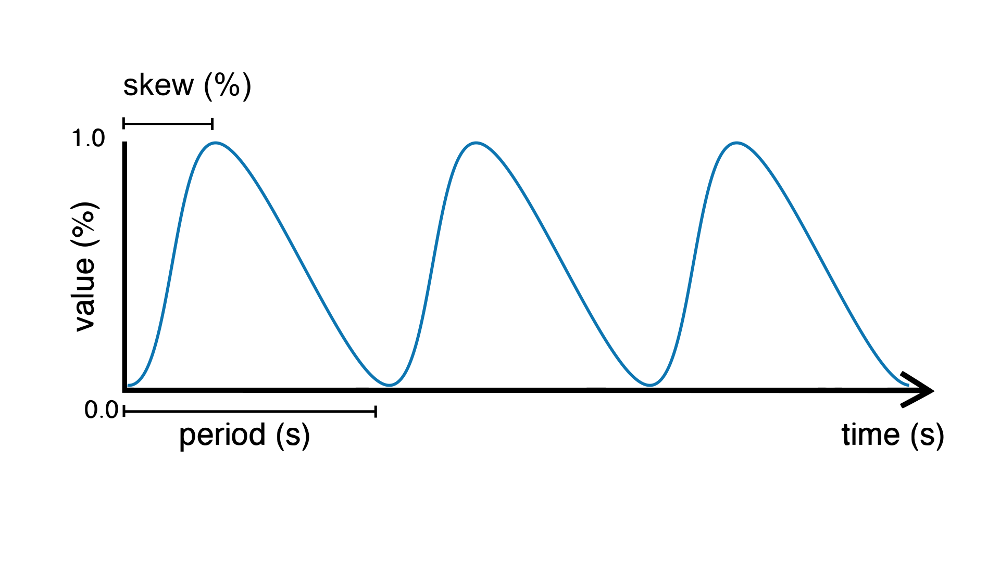
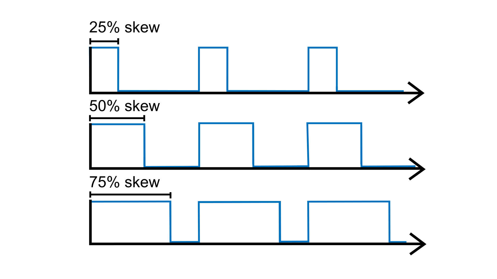
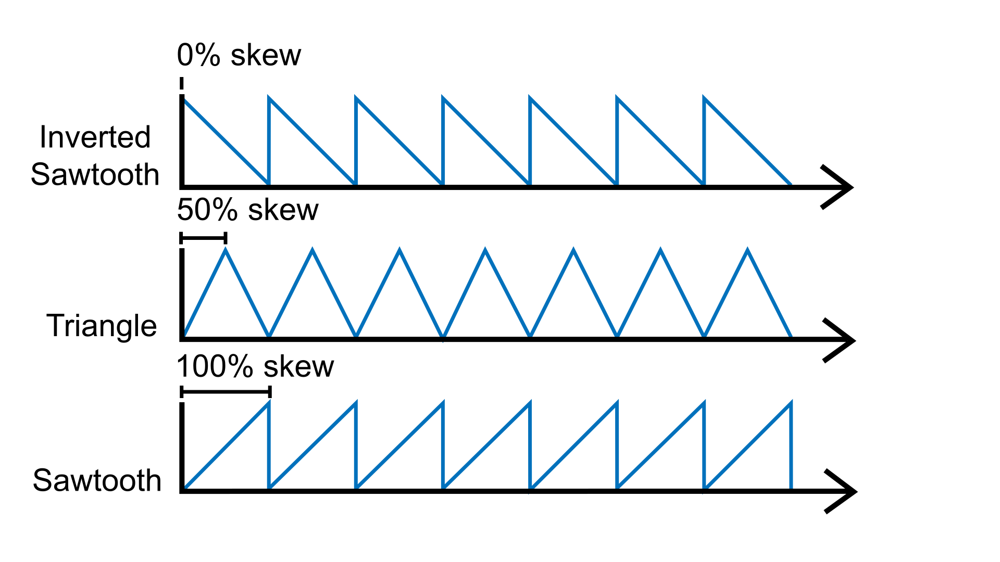

.. include:: defs.hrst

Wave
====

An analog source unit that generates a `wave <https://en.wikipedia.org/wiki/Wave>`_ signal in range [0, 1].

Shape
-----

There are three potential wave types that can be set using the ``shape`` parameter:
:ref:`SQUARE (default) <square-wave>`, :ref:`TRIANGLE <triangle-wave>` or :ref:`SINE <sine-wave>`.

Parameters
----------

  .. list-table::
     :header-rows: 1
     :widths: 12 40 12 12 12 12

     * - Name
       - Description
       - Range
       - Setter
       - Getter
       - Flow
     * - period
       - Duration of one complete cycle.
       - > 0 (s)
       - ``period(v)``
       - ``period()``
       - ``Period()``
     * - frequency
       - Cycles per second (inverse of period).
       - > 0 (Hz)
       - ``frequency(v)``
       - ``frequency()``
       - ``Frequency()``
     * - bpm
       - Cycles per minute (alternative to frequency).
       - > 0
       - ``bpm(v)``
       - ``bpm()``
       - ``Bpm()``
     * - skew
       - Balance between rising/falling portions of cycle.
       - [0, 1]
       - ``skew(v)``
       - ``skew()``
       - ``Skew()``
     * - phase
       - Current point in the wave cycle (as % of period).
       - [0, 1]
       - ``phase(v)``
       - ``phase()``
       - ``Phase()``
     * - phaseShift
       - Phase offset (as % of period).
       - [0, 1]
       - ``phaseShift(v)``
       - ``phaseShift()``
       - ``PhaseShift()``
     * - jitter
       - :ref:`Randomness level <wave-randomization>` for timing variation.
       - [0, 1]
       - ``jitter(v)``
       - ``jitter()``
       - ``Jitter()``

.. _square-wave:

Square Wave
-----------

Generates a `square wave <https://en.wikipedia.org/wiki/Square_wave>`_ signal when the ``shape`` parameter is
set to ``SQUARE``. The square wave is the default for this parameter.

For the ``SQUARE`` wave, the ``skew`` represents the proportion of time (expressed as a percentage) in each
cycle (period) during which the wave is "on" -- in other words, its *duty cycle*.

|Example|
---------

Makes the built-in LED blink with a period of 4 seconds. Because the duty cycle
is set to 25%, the LED will stay on for 1 second and then off for 3 seconds.

.. code-block:: c++

   #include <Plaquette.h>

   DigitalOut led(13);

   Wave blinkOsc(SQUARE, 4.0);

   void begin() {
     blinkOsc.skew(0.25); // Sets the duty cycle to 25%
   }

   void step() {
     blinkOsc >> led;
   }

.. _triangle-wave:

Triangle Wave
-------------

Generates a wave such as the
`triangle wave <https://en.wikipedia.org/wiki/Triangle_wave>`_ and the
`sawtooth wave <https://en.wikipedia.org/wiki/Sawtooth_wave>`_ when the ``shape`` parameter is set to ``TRIANGLE``.

In this case, the ``skew`` parameter represents the "turning point" during the period at which
the signals reaches its maximum and starts going down again. Changing the skew
allows to generate different kinds of triangular-shaped waves. For example, by
setting skew to 1.0 (100%) one obtains a *sawtooth* wave; by setting it to 0.0 (0%)
an *inverted sawtooth* is created; anything in between generates different flavors
of *triangle* waves.

|Example|
---------

Controls a set of traffic lights that go: red, yellow, green, red, yellow,
green, and so on. It uses a sawtooth to iterate through these three states.

.. code-block:: c++

   #include <Plaquette.h>

   DigitalOut green(10);
   DigitalOut yellow(11);
   DigitalOut red(12);

   Wave osc(TRIANGLE, 10.0);

   void begin() {
   // Setting skew to 1.0 converts triangle wave to a sawtooth wave.
     osc.skew(1.0);
   }

   void step() {
     // Shut down all lights.
     0 >> led >> yellow >> green;
     // Switch appropriate LED.
     if (osc < 0.4)
       green.on();
     else if (osc < 0.6)
       yellow.on();
     else
       red.on();
   }

.. _sine-wave:

Sine Wave
---------

Generates a sinusoid or `sine wave <https://en.wikipedia.org/wiki/Sine_wave>`_ when the ``shape`` parameter is set to ``SINE``.
The signal is remapped to oscillate between 0 and 1 (rather than -1 and 1 as the traditional sine wave
function).

Here, the ``skew`` parameter controls when the sine wave reaches its peak within a cycle. A skew value of
0.5 (default) yields a standard symmetric sine wave. Lower values shift the peak earlier (left-skewed),
while higher values shift it later (right-skewed), allowing for asymmetric sine shapes while preserving smoothness.

|Example|
---------

Pulses an LED.

.. code-block:: c++

   #include <Plaquette.h>

   AnalogOut led(9);

   Wave osc(SINE);

   void begin() {
     osc.frequency(5.0); // frequency of 5 Hz
   }

   void step() {
     osc >> led;
   }

.. _wave-randomization:

Randomization
-------------

In addition to controlling shape, period, and skew,``Wave`` units can also generate
**randomized oscillations** in a similar manner as :doc:`Metronome` units using the ``randomize`` function.
This allows the oscillation to feel less mechanical and more organic, closer to natural rhythms like breathing,
heartbeat variations, or the flicker of firelight.

When randomness is active, the wave no longer produces perfectly periodic oscillations. Instead,
each cycle's duration is perturbed according to the chosen randomness level. However, on the long run,
the average period of oscillation will match the wave's ``period`` parameter.

|Example|
---------

Pulse an LED. Uses a low-frequency oscillator (LFO) to slowly modify the wave's randomness.

.. code-block:: c++

  #include <Plaquette.h>

  AnalogOut led(9);

  Wave osc(SINE); // Default value of wave period is 1 second.

  Wave lfo(SINE, 20.0); // 20-seconds oscillator

  void step() {
    osc.randomize(lfo);
    osc >> led;
  }

.. doxygenclass:: Wave
   :project: Plaquette
   :members:

|SeeAlso|
---------
- :doc:`Metronome`
- :doc:`Ramp`
