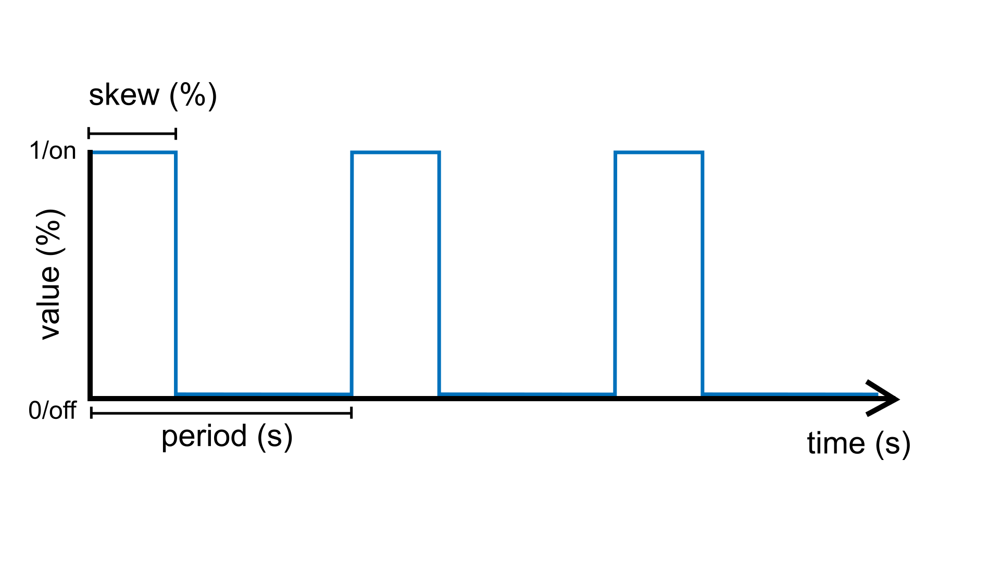

.. include:: defs.hrst

====
Wave
====

A source unit that generates a `wave <https://en.wikipedia.org/wiki/Wave>`_ signal. There are three potential wave types that can be set
using the ``shape`` parameter: :ref:`SQUARE (default) <square-wave>`, :ref:`TRIANGLE <triangle-wave>` or :ref:`SINE <sine-wave>`.

.. image:: images/Plaquette-TriangleWave.png
  :width: 33%

.. image:: images/Plaquette-SineWave-noSkew.png
  :width: 33%

Regardless of the shape, the signal can be tuned by adjusting the following parameters:

- **shape()**: Sets the shape of the wave (:ref:`SQUARE (default) <square-wave>`, :ref:`TRIANGLE <triangle-wave>` or :ref:`SINE <sine-wave>`).
- **period()**: Sets the duration of one cycle in seconds.
- **skew()**: Controls the balance between the rising and falling portions of the wave cycle (in range [0, 1]).
  Each wave type behaves slightly differently with this parameter, which will be detailed below.
- **frequency()**: Inverse of period; sets the cycles per second (Hz).
- **bpm()**: Alternative way to set the frequency using beats per minute (BPM).
- **phase()**: Sets the initial point in the wave cycle (as % of period) (in range [0, 1]).
- **amplitude()**: Sets the peak level of the wave (as % of max) (in range [0, 1]);

.. _square-wave:

Square Wave
-----------

Generates a `square wave <https://en.wikipedia.org/wiki/Square_wave>`_ signal when the ``shape`` parameter is
set to ``SQUARE``. The square wave is the default for this parameter.

For the ``SQUARE`` wave, the ``skew`` represents the proportion of time (expressed as a percentage) in each
cycle (period) during which the wave is "on" -- in other words, its *duty cycle*.

.. image:: images/Plaquette-SquareWave-Skew.png

|Example|
---------

Makes the built-in LED blink with a period of 4 seconds. Because the duty cycle
is set to 25%, the LED will stay on for 1 second and then off for 3 seconds.

.. code-block:: c++

   #include <Plaquette.h>

   DigitalOut led(13);

   Wave blinkOsc(SQUARE, 4.0);

   void begin() {
     blinkOsc.skew(0.25); // Sets the duty cycle to 25%
   }

   void step() {
     blinkOsc >> led;
   }

.. _triangle-wave:

Triangle Wave
-------------

Generates a wave such as the
`triangle wave <https://en.wikipedia.org/wiki/Triangle_wave>`_ and the
`sawtooth wave <https://en.wikipedia.org/wiki/Sawtooth_wave>`_ when the ``shape`` parameter is set to ``TRIANGLE``.

.. image:: images/Plaquette-TriangleWave.png

In this case, the ``skew`` parameter represents the "turning point" during the period at which
the signals reaches its maximum and starts going down again. Changing the skew
allows to generate different kinds of triangular-shaped waves. For example, by
setting skew to 1.0 (100%) one obtains a *sawtooth* wave; by setting it to 0.0 (0%)
an *inverted sawtooth* is created; anything in between generates different flavors
of *triangle* waves.

.. image:: images/Plaquette-TriangleWave-Skew.png

|Example|
---------

Controls a set of traffic lights that go: red, yellow, green, red, yellow,
green, and so on. It uses a sawtooth to iterate through these three states.

.. code-block:: c++

   #include <Plaquette.h>

   DigitalOut green(10);
   DigitalOut yellow(11);
   DigitalOut red(12);

   Wave osc(TRIANGLE, 10.0);

   void begin() {
     osc.skew(1.0); // sawtooth wave
   }

   void step() {
     // Shut down all lights.
     0 >> led >> yellow >> green;
     // Switch appropriate LED.
     if (osc < 0.4)
       green.on();
     else if (osc < 0.6)
       yellow.on();
     else
       red.on();
   }

.. _sine-wave:

Sine Wave
---------

Generates a sinusoid or `sine wave <https://en.wikipedia.org/wiki/Sine_wave>`_ when the ``shape`` parameter is set to ``SINE``.
The signal is remapped to oscillate between 0 and 1 (rather than -1 and 1 as the traditional sine wave
function).

Here, the ``skew`` parameter controls when the sine wave reaches its peak within a cycle. A skew value of
0.5 (default) yields a standard symmetric sine wave. Lower values shift the peak earlier (left-skewed),
while higher values shift it later (right-skewed), allowing for asymmetric sine shapes while preserving smoothness.

.. image:: images/Plaquette-SineWave.png

|Example|
---------

Pulses an LED.

.. code-block:: c++

   #include <Plaquette.h>

   AnalogOut led(9);

   Wave osc(SINE);

   void begin() {
     osc.frequency(5.0); // frequency of 5 Hz
   }

   void step() {
     osc >> led;
   }

.. doxygenclass:: Wave
   :project: Plaquette
   :members:

