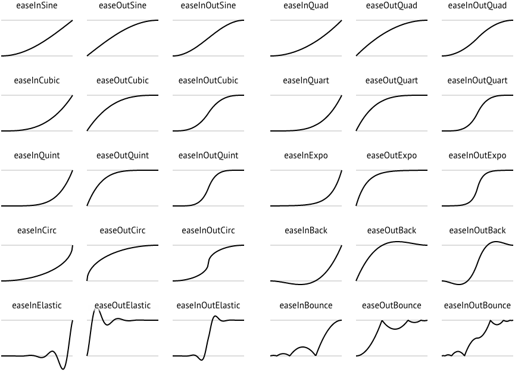

.. include:: defs.hrst

Easings
=======

Easing functions apply non-linear effects to changing values, in order to create
expressive real-time outputs. Plaquette provides users with a wide range of such
functions, typically used with a Ramp unit.

All easing functions have the same signature:

.. code-block:: c++

   float easeFunction(float t)

Value ``x`` should be between 0.0 and 1.0, the returned value is also between 0.0 and 1.0.

This is the list of all easing functions (source: http://easings.net):

|SeeAlso|
---------
- :doc:`Ramp`
