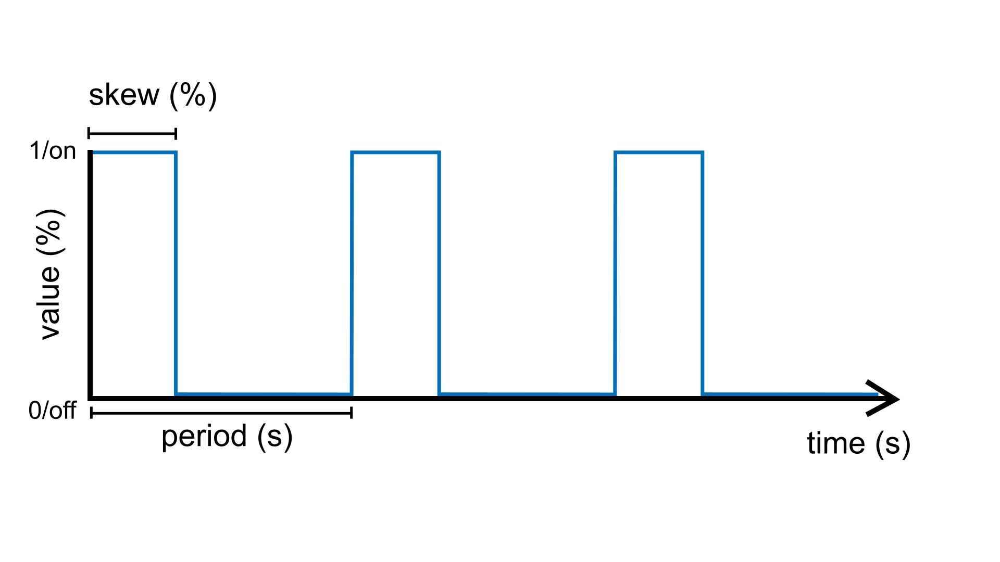
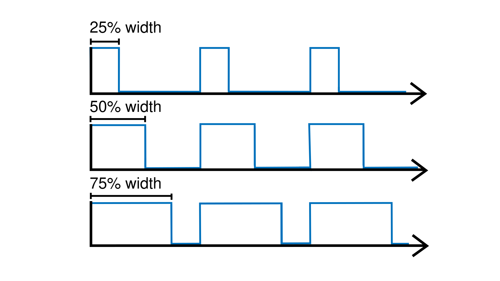
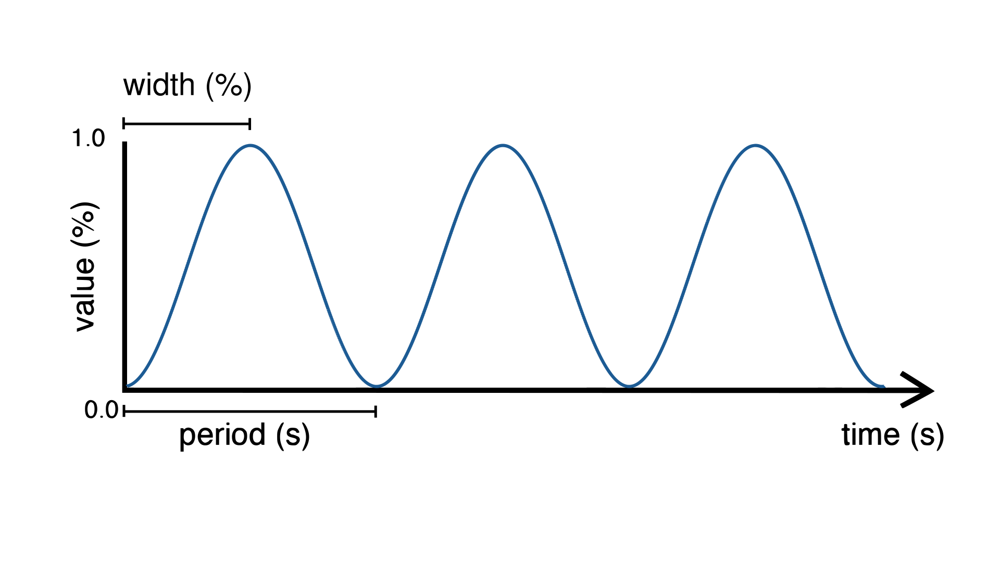

Getting started
===============

This short introduction will guide you through the first steps of using Plaquette.

We also recommend watching our introductory `video tutorial series <https://www.youtube.com/playlist?list=PLO0YogNIPwXwEsNsoQSKeCdYlepWFrYip>`_.

.. image:: https://img.youtube.com/vi/1H_lj-bvPNc/maxresdefault.jpg
    :alt: Introduction to Plaquette video tutorial series
    :target: https://www.youtube.com/playlist?list=PLO0YogNIPwXwEsNsoQSKeCdYlepWFrYip

Step 1: Install Plaquette
--------------------------

If you do not have Arduino installed on your machine you need to
`download and install the Arduino
IDE <https://www.arduino.cc/en/Main/Software>`__ for your platform.

Once Arduino is installed, please install Plaquette as an Arduino
library following `these
instructions <https://www.arduino.cc/en/Guide/Libraries>`__.

Step 2: Your first Plaquette program
------------------------------------

We will begin by creating a simple program that will make the built-in
LED on your microcontroller blink.

Create a new sketch
~~~~~~~~~~~~~~~~~~~

Create a new empty sketch by selecting **File > New**.

**IMPORTANT:** New Arduino sketches are initialized with some "slug"
starting code. Make sure to erase the content of the sketch before
beginning. You can use **Edit > Select All** and then click **Del** or
**Backspace**.

Include library
~~~~~~~~~~~~~~~

Include the Plaquette library by typing:

.. code:: cpp

    #include <Plaquette.h>

Create an output unit
~~~~~~~~~~~~~~~~~~~~~

Now, we will create a new unit that will allow us to control the
built-in LED:

.. code:: cpp

    DigitalOut myLed(13);

In this statement, ``DigitalOut`` is the **type** of unit that we are
creating. There also exists other types of units, which will be described later.
``DigitalOut`` is a type of software unit that can represent one of the many
hardware pins for digital output on the Arduino board. One way to think about this is that
the ``DigitalOut`` is a "virtual" version of the Arduino pin. These can be set to one of two
states: ("on/off", "high/low", "1/0").

The word ``myLed`` is a **name** for the object we are creating.

Finally, ``13`` is a **parameter** of the object ``myLed`` that specifies the hardware
*pin* that it corresponds to on the board. In English, the statement would thus read 
as: "Create a unit named ``myLed`` of type ``DigitalOut`` on pin ``13``."

.. note::
  Most Arduino boards have a pin connected to an on-board LED in series with a resistor and on 
  most boards, this LED is connected to digital pin ``13``. The constant ``LED_BUILTIN`` is 
  the number of the pin to which the on-board LED is connected.

Create an input unit
~~~~~~~~~~~~~~~~~~~~

We will now create another unit that will generate a signal which will
be sent to the LED to make it blink. To this effect, we will use the
``SquareWave`` unit type which generates a `square
wave <https://en.wikipedia.org/wiki/Square_wave>`__ oscillating between
"on/high/one" and "off/low/zero" at a regular period of 2.0 seconds:

.. code:: cpp

    SquareWave myWave(2.0);

Create the begin() function
~~~~~~~~~~~~~~~~~~~~~~~~~~~

Each Plaquette sketch necessitates the declaration of two functions:
``begin()`` and ``step()``.

Function ``begin()`` is called only once at the beginning of the sketch
(just like the
`setup() <https://www.arduino.cc/reference/en/language/structure/sketch/setup/>`__
function in Arduino). For our first program, we do not need to perform any 
special configuration at startup so we will leave the ``begin()`` function
empty:

.. code:: cpp

    void begin() {}

Create the step() function
~~~~~~~~~~~~~~~~~~~~~~~~~~

The ``step()`` function is called repetitively and indefinitely during
the course of the program (like the
`loop() <https://www.arduino.cc/reference/en/language/structure/sketch/loop/>`__
function in Arduino).

Here, we will send the signal generated by the ``myWave`` input unit
to the ``myLed`` output unit. We will do this by using Plaquette's special
``>>`` operator:

.. code:: cpp

    void step() {
      myWave >> myLed;
    }

In plain English, the statement ``myWave >> myLed`` reads as: "Take the
value generated by ``myWave`` and put it in ``myLed``."

Upload sketch
~~~~~~~~~~~~~

Upload your sketch to the Arduino board. You should see the LED on the
board **blinking once every two seconds at a regular pace**.

Et voilà!

Full code
~~~~~~~~~

.. code:: cpp

    #include <Plaquette.h>

    DigitalOut myLed(13);

    SquareWave myWave(2.0);

    void begin() {}

    void step() {
      myWave >> myLed;
    }

Step 3 : Experiment!
--------------------

So far so good. Let's see if we can push this a bit further.

Change initial parameters of a unit
~~~~~~~~~~~~~~~~~~~~~~~~~~~~~~~~~~~

The ``SquareWave`` unit type provides two parameters when it is created that allows
you to configure the oscillator's behavior.

.. code:: cpp

    SquareWave myWave(period, width);

- ``period`` can be any positive number representing the period of oscillation (in seconds)
- ``width`` can be any number between 0.0 (0%) and 1.0 (100%), and represents the proportion 
  of the period during which the signal is "high" (ie. "on duty") (default: 0.5)

.. note::
   We call this step the **construction** or **instantiation** of the object ``myWave``.

Try changing the first parameter (period) in the square oscillator unit to change 
the period of oscillation.

- ``SquareWave myWave(1.0);`` for a period of one second
- ``SquareWave myWave(2.5);`` for a period of 2.5 seconds
- ``SquareWave myWave(10.0);`` for a period of 10 seconds
- ``SquareWave myWave(0.5);`` for a period of half a second (500 milliseconds)

.. warning::
   Don't forget to re-upload the sketch after each change.

Now try adding a second parameter (width) to control the oscillator's
`width <https://en.wikipedia.org/wiki/Duty_cycle>`__. For a fixed period, try changing 
the duty cycle to different percentages between 0.0 and 1.0.

- ``SquareWave myWave(2.0, 0.5);`` for a width of 50% (default)
- ``SquareWave myWave(2.0, 0.25);`` for a width of 25%
- ``SquareWave myWave(2.0, 0.75);`` for a width of 75%
- ``SquareWave myWave(2.0, 0.9);`` for a width of 90%

Change parameters of a unit during runtime
~~~~~~~~~~~~~~~~~~~~~~~~~~~~~~~~~~~~~~~~~~

What if we wanted to change the parameters of the oscillator during runtime rather than
just at the beginning? The ``SquareWave`` unit type allows real-time modification of
its parameters by calling one of its functions using the :doc:`dot` operator.

For example, to change the period, simply call the following inside the ``step()`` function:

.. code:: cpp

    void step() {
      myWave.period(newPeriod);
      myWave >> myLed;
    }

Of course, to accomplish our goal, we need a way to *change* the value ``newPeriod`` 
during runtime. We can accomplish this in many different ways, but let's try something 
simple: we will use another wave to *modulate* our wave's period.

For this, we will be using another kind of source called a ``SineWave`` and will use its
outputs to change the period of ``myWave``.

.. code:: cpp
    
    SineWave myModulator(20.0);

This wave will oscillate smoothly from 0 to 1 every 20 seconds.

.. code:: cpp
    
    void step() {
      myWave.period(myModulator);
      myWave >> myLed;
    }

Upload the sketch and you should see the LED blinking as before, with the difference that
the blinking speed will now change from blinking very fast (in fact, infinitely fast, with 
a period of zero seconds!) to very slow (period of 20 seconds).

.. note::

   If you want to visualize the values of both waves on your computer, you can print them 
   on the serial port one after the other, separated by a space. Add the following code to
   your ``step()`` function:

   .. code:: cpp

     print(myWave); print(" "); println(myModulator);

   Then, launch the Arduino `Serial Plotter <https://docs.arduino.cc/software/ide-v2/tutorials/ide-v2-serial-plotter/>`__
   by selecting in in **Tools > Serial Plotter**.

Now try modulating the width of ``myWave`` instead of its period:

.. code:: cpp
    
    myWave.width(myModulator);

Use a button
~~~~~~~~~~~~

Now let's try to do some very simple interactivity by using a simple switch or button. For this
we will be using the internal pull-up resistor available on Arduino boards for a very simple circuit.
One leg of the button should be connected to ground (GND) while the other should be connected to 
digital pin 2.

.. note::
   
   If you do not have a button or switch, you can just use two electric wires: one connected to 
   ground (GND) and the other one to digital pin 2. When you want to press the button, simply touch 
   the wires together to close the circuit.

Declare the button unit with the other units at the top of your sketch:

.. code:: cpp

   DigitalIn myButton(2, INTERNAL_PULLUP);

You will notice that the type of this unit (:doc:`DigitalIn`) resembles that of our LED-controlling
unit (:doc:`DigitalOut`). This is because both units have something in common: they have only two states:
either on or off, high or low, true or false, one or zero, hence the adjective ``Digital``. However,
while the LED is considered an output or actuator (``Out``) our button is rather an input or sensor
(``In``).

.. note::

   If you are curious, you might also want to know that there is an :doc:`AnalogIn` and an :doc:`AnalogOut`
   types which support sensors and actuators that work with continuous values between 0 and 1 (0% to 100%).

Now, let's use this button as a way to control whether the LED blinks or not. For this, we will need to use 
the value of the button as part of a **condition** for an
`if...else <https://www.arduino.cc/reference/en/language/structure/control-structure/if/>`__
statement.

.. code:: cpp

    void step() {
      if (myButton)
        myWave >> myLed;
      else
        0 >> myLed;
    }

.. note::
   You can rewrite this expression in a more compact way using the 
   `conditional operator (?) <https://www.tutorialspoint.com/arduino/arduino_conditional_operator.htm>`__:

   .. code:: cpp

      void step() {
        (myButton ? myWave : 0) >> myLed;
      }

Full code
~~~~~~~~~

.. code:: cpp

    #include <Plaquette.h>

    DigitalOut myLed(13);

    SquareWave myWave(2.0);

    SineWave myModulator(20.0);

    DigitalIn myButton(2, INTERNAL_PULLUP);

    void begin() {}

    void step() {
      myWave.period(myModulator);

      if (myButton)
        myWave >> myLed;
      else
        0 >> myLed;
    }

More examples
~~~~~~~~~~~~~

You will find more examples in **File > Examples > Plaquette** including:

- Using an analog input such as a photocell or potentiometer
- Using an analog output
- Basic filtering (smoothing, re-scaling)
- Serial input and output
- Event management

We also recommend watching our introductory `video tutorial series <https://www.youtube.com/playlist?list=PLO0YogNIPwXwEsNsoQSKeCdYlepWFrYip>`_.