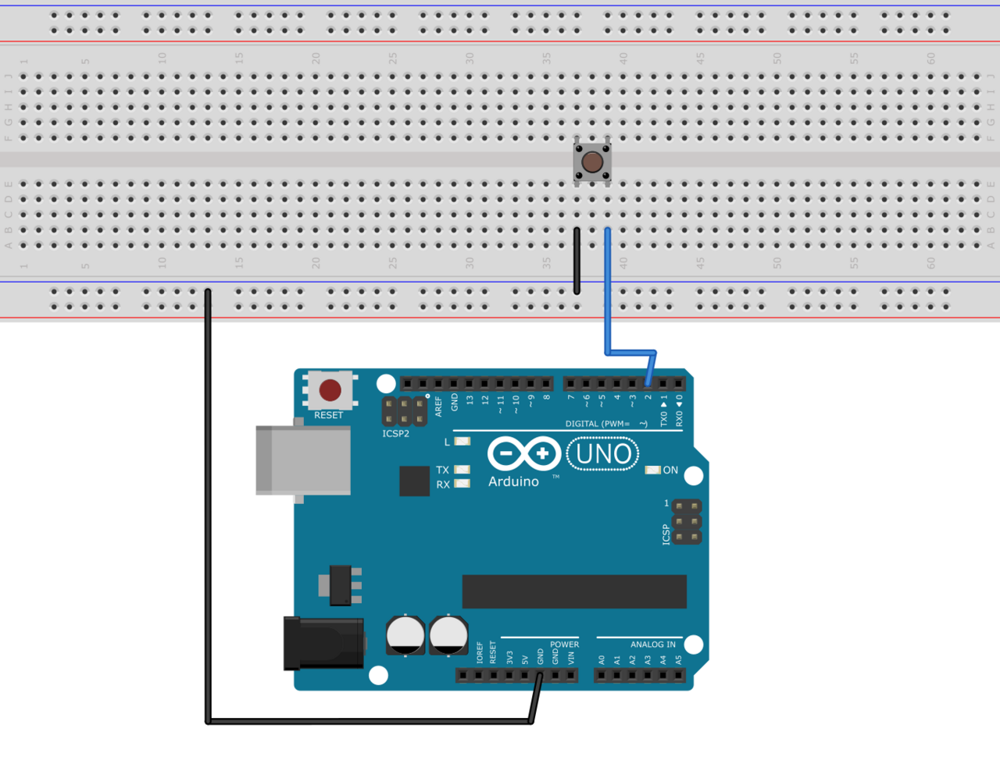
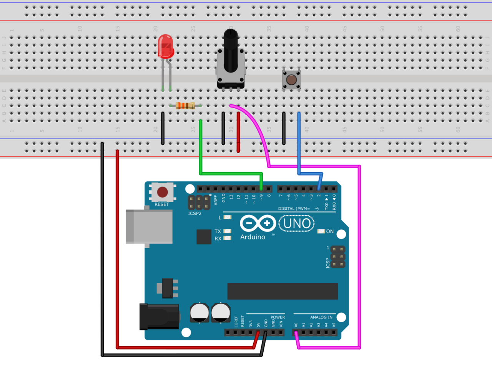

==================
Inputs and Outputs
==================

When working with Plaquette, **inputs** and **outputs** allow you to interact with the physical
world. Whether you are reading a sensor's value or controlling an actuator, Plaquette makes this
process intuitive and efficient. This section introduces the basic concepts of digital and analog
inputs and outputs, presents Plaquette's unique syntax for efficient and expressive code, explains
how to clean noisy data, shows how to make decisions based on input values, and describes the
different configuration modes of input and output units.

Let's explore these ideas step by step.

Digital vs Analog
-----------------

Before diving into code, let's first clarify the difference between **digital** and **analog**
signals.

- **Digital** signals represent binary states: ON vs OFF, HIGH vs LOW, 1 vs 0, true vs false. Examples of digital
  inputs include buttons and presence sensors, while digital outputs might control LEDs or relays.
- **Analog** signals represent a continuous range of values. Think of a dimmer switch (potentiometer)
  or a light sensor that measures brightness levels. Analog outputs control devices such as LEDs with
  variable brightness and DC motors where the speed can vary.

.. warning::

  On many microcontrollers, analog outputs are generated using **Pulse Width Modulation (PWM)** rather
  than a true **Digital-to-Analog Converter (DAC)**. PWM rapidly switches the output pin between HIGH
  and LOW, creating the illusion of a continuous analog voltage when averaged over time. While this
  works for controlling brightness in LEDs or speed in motors, it may not be suitable for applications
  requiring a steady, smooth signal.

  For more information, visit the official Arduino documentation on
  `Pulse Width Modulation <https://www.arduino.cc/en/Tutorial/Foundations/PWM>`__.

Digital Inputs and Outputs
--------------------------

Let's look at the basics of digital signals by working with LEDs and buttons.

**Digital Outputs**
~~~~~~~~~~~~~~~~~~~
A :doc:`DigitalOut` unit controls devices that can be turned ON or OFF, such as LEDs or relays.
Here's an example of how to control an LED:

.. code-block:: cpp

    #include <Plaquette.h>

    DigitalOut led(13); // LED connected to pin 13

    void begin() {
      led.on(); // Turn the LED on initially
    }

    void step() {
      if (seconds() > 10.0)
        led.off(); // Turn the LED off after 10 seconds
    }

**Digital Inputs**
~~~~~~~~~~~~~~~~~~
A :doc:`DigitalIn` unit reads binary states from devices like buttons or switches. The easiest way
to connect a button or switch is to use the **internal pull-up** resistor on Arduino boards. One
leg of the  button should be connected to ground (GND) while the other should be connected to a digital pin.

.. code-block:: cpp

    #include <Plaquette.h>

    DigitalIn button(2, INTERNAL_PULLUP); // Button connected to pin 2
    DigitalOut led(13);                   // LED connected to pin 13

    void begin() {}

    void step() {
      if (button.isOn()) {  // Check if the button is pressed
        led.on();
      } else {
        led.off();
      }
    }

Analog Outputs and Inputs
-------------------------

Next, we will explore analog signals, which allow for finer control and more detailed readings.

**Analog Outputs**
~~~~~~~~~~~~~~~~~~
An :doc:`AnalogOut` unit controls devices like LEDs or motors with continuous values. Here's an
example of dimming an LED. The cathode (short leg) of the LED should be connected to ground, while
the anode (long leg) should be connected to a 300 :math:`\Omega` resistor, which in turn should be
connected to an analog / PWM pin (eg. pin 9).

.. code-block:: cpp

    #include <Plaquette.h>

    AnalogOut led(9); // LED connected to pin 9

    void begin() {
      led.put(0); // Set LED brightness to 0%
    }

    void step() {
      led.put( seconds() / 10 ); // Will reach 100% after 10 seconds
    }

**Analog Inputs**
~~~~~~~~~~~~~~~~~
An :doc:`AnalogIn` unit reads continuous values from sensors, such as potentiometers, light,
or temperature sensors.

Let's use a potentiometer to control an LED's brightness. For this circuit, the center pin
of the potentiometer should be connected to analog input pin (``A0``), the left pin to ground
(GND) and the right pin to +5V (Vcc).

.. code-block:: cpp

    #include <Plaquette.h>

    AnalogIn dimmer(A0); // Potentiometer on analog pin A0
    AnalogOut led(9);    // LED on pin 9

    void begin() {}

    void step() {
      led.put(dimmer.get()); // Map the potentiometer value directly to LED brightness
    }

Using Units as Their Own Values
-------------------------------

Plaquette offers an elegant shortcut: you don't need to explicitly call ``isOn()`` or ``get()`` for
digital or analog inputs. Instead, you can use the input or output unit itself in lieu of the value
it contains. This makes your code cleaner and easier to read.

Here's the same LED and button example, rewritten with this feature:

.. code-block:: cpp

    #include <Plaquette.h>

    DigitalIn button(2, INTERNAL_PULLUP);
    DigitalOut led(13);

    void begin() {}

    void step() {
      if (button) {  // No need for button.isOn() : just use button as its own value
        led.on();
      } else {
        led.off();
      }
    }

For analog inputs, this works similarly. Instead of calling ``dimmer.get()``, you can use the
``dimmer`` unit directly:

.. code-block:: cpp

    #include <Plaquette.h>

    AnalogIn dimmer(A0);
    AnalogOut led(9);

    void begin() {}

    void step() {
      led.put(dimmer); // No need for dimmer.get() : just use dimmer as its own value
    }

These simplifications make your code more expressive and emphasize the logic over the syntax.

The Flow Operator (>>)
----------------------

In Plaquette, the ``>>`` operator allows you to directly send the value of one unit to
another. This makes it incredibly simple to map inputs to outputs without extra variables or
function calls.

Let's revisit the potentiometer and LED example using the piping operator:

.. code-block:: cpp

    #include <Plaquette.h>

    AnalogIn dimmer(A0);
    AnalogOut led(9);

    void begin() {}

    void step() {
      dimmer >> led; // Directly pipe the potentiometer value to the LED
    }

This operator improves code readability and emphasizes the relationship between inputs and outputs.

.. note::

  The piping operator (``>>``) allows to expressively connect input, output, and filtering units
  in a similar fashion to data-flow environments such as `Max <https://cycling74.com/products/max>`_,
  `Pure Data <https://puredata.info>`_, and `TouchDesigner <https://derivative.ca>`_. The operator is
  directly inspired from the ChucK operator (``=>``) in programming languge `ChucK <http://chuck.cs.princeton.edu/>`__.

Dealing with Noisy Signals: Debouncing and Smoothing
----------------------------------------------------

In real-world applications, signals can be messy. Buttons can produce electrical noise when pressed,
and analog sensors might give fluctuating readings. Plaquette provides tools to handle these issues:
**debouncing** for digital signals and **smoothing** for analog ones.

Debouncing
~~~~~~~~~~

Debouncing ensures that a button press is recorded cleanly, ignoring any noise. Here's how to
debounce a button:

.. code-block:: cpp

    #include <Plaquette.h>

    DigitalIn button(2, INTERNAL_PULLUP); // Button with pull-up resistor
    DigitalOut led(13);                   // LED on pin 13

    void begin() {
      button.debounce(); // Debounce the button
    }

    void step() {
      if (button.rose()) {  // Detect a clean press
        led.toggle();       // Toggle the LED state
      }
    }

Smoothing
~~~~~~~~~

For analog signals, smoothing helps stabilize noisy data.

Here's how you can smooth a light sensor (photoresistor). For this circuit, you will need to
create a simple `voltage divider circuit <https://learn.sparkfun.com/tutorials/voltage-dividers>`__.
Connect the photoresistor between the ground (GND) and the analog input pin (``A0``). Then connect
a fixed resistor with value matching your photoresistor between analog input pin and +5V (Vcc).
For example, for a 1k :math:`\Omega` - 10k :math:`\Omega` photoresistor you could use a fixed
resistor of about 5.5k :math:`\Omega`).

.. image:: images/Plaquette-CircuitVoltageDivider.png
    :align: center

.. code-block:: cpp

    #include <Plaquette.h>

    AnalogIn lightSensor(A0);
    AnalogOut led(9);

    void begin() {
      lightSensor.smooth(); // Apply default smoothing
    }

    void step() {
      lightSensor >> led;
    }

You can adjust the level of smoothing and deboucing by indicating a parameter representing the
time window (in seconds) over which the value is averaged. Experiment with different smoothing values
to see the result:

* ``lightSensor.smooth()`` : Default smoothing window (100ms)
* ``lightSensor.smooth(1.0)`` : Smooth over one second
* ``lightSensor.smooth(10.0)`` : Smooth over 10 seconds
* ``lightSensor.smooth(0.01)`` : Smooth over 10ms

Mapping Values to Different Ranges
----------------------------------

Sometimes, the output of a sensor doesn't match the range needed for an actuator. Plaquette
provides a simple **mapping function** ``mapTo(low, high)`` which maps the analog input value
to a specified range which is very useful for scaling sensor readings.

**Example**: Controlling the blinking frequency of an LED based on the value of a light sensor.

.. code-block:: cpp

    #include <Plaquette.h>

    AnalogIn lightSensor(A0);
    DigitalOut led(13);
    Wave wave(1.0);

    void begin() {}

    void step() {
      // Map sensor value to frequency in range 1-10 Hz
      wave.frequency( lightSensor.mapTo(1, 10) );
      // Control LED with wave.
      wave >> led;
    }

Making Decisions with Conditions
--------------------------------

Interactive systems often need to respond to changes in input. Plaquette provides convenient
methods like ``rose()``, ``fell()``, and ``changed()`` for detecting transitions in digital signals.

Digital Conditions
~~~~~~~~~~~~~~~~~~

Here's an example of toggling an LED when a button is pressed:

.. code-block:: cpp

    #include <Plaquette.h>

    DigitalIn button(2, INTERNAL_PULLUP);
    DigitalOut led(13);

    void begin() {}

    void step() {
      if (button.rose()) { // Detect the moment the button is pressed
        led.toggle();      // Toggle the LED state
      }
    }

Analog Conditions
~~~~~~~~~~~~~~~~~

Analog conditions are useful when you want to trigger actions based on a threshold. For instance,
turning on an LED when the light level drops below 30% (0.3):

.. code-block:: cpp

    #include <Plaquette.h>

    AnalogIn lightSensor(A0);
    DigitalOut led(13);

    void begin() {}

    void step() {
      if (lightSensor < 0.3) {
        led.on();  // Turn on LED in low light
      } else {
        led.off(); // Turn off LED in bright light
      }
    }

Modes for Inputs and Outputs
----------------------------

All input and output units in Plaquette support different modes, which allow you to adapt to various
circuit configurations. You may already be familiar with the ``INTERNAL_PULLUP`` mode from
:doc:`DigitalIn`, which provides a simple way to connect a button input. Let's explore how modes affect
:doc:`DigitalIn`, :doc:`AnalogIn`, :doc:`DigitalOut`, and :doc:`AnalogOut` units.

Understanding these modes helps you design stable and efficient circuits, whether you're reading
inputs or driving outputs. Choose the mode that best fits your hardware setup and application
requirements.

**DigitalIn Modes: DIRECT, INVERTED, and INTERNAL_PULLUP**
~~~~~~~~~~~~~~~~~~~~~~~~~~~~~~~~~~~~~~~~~~~~~~~~~~~~~~~~~~
The :doc:`DigitalIn` unit supports three primary modes:

- **DIRECT** (default): The unit is ON when the input pin is HIGH (e.g., 5V). This mode is used for buttons
  with pull-down resistors, which keep the pin LOW (OFF) when the button is not pressed and allow it
  to go HIGH (ON) when the button is pressed. Pull-down resistors typically have values around
  10k :math:`\Omega`.

  **Example**: Button connected between pin 2 and 5V with a pull-down resistor to ground:

  .. code-block:: cpp

      DigitalIn button(2, DIRECT);
      DigitalOut led(13);

      void step() {
        if (button) {
          led.on();
        } else {
          led.off();
        }
      }

- **INVERTED**: The unit is ON when the input pin is LOW (e.g., GND). This is useful for buttons
  with pull-up resistors, which keep the pin HIGH when the button is not pressed and allow it to go
  LOW when the button is pressed. The ``INTERNAL_PULLUP`` mode activates an internal pull-up resistor,
  simplifying the circuit.

  **Example**: Button connected between pin 2 and ground with a pull-down resistor to +5V (Vcc):

  .. code-block:: cpp

      DigitalIn button(2, INVERTED);

- **INTERNAL_PULLUP**: As in mode ``INVERTED`` the unit is ON when the input pin is LOW (e.g., GND).
  Makes use of the internal pull-up resistor on the board, therefore removing the need to add a pull-up
  resistor.

  **Example**: Button connected between pin 2 and ground (no need for an extra pull-up resistor):

  .. code-block:: cpp

      DigitalIn button(2, INTERNAL_PULLUP);

**AnalogIn Modes: DIRECT and INVERTED**
~~~~~~~~~~~~~~~~~~~~~~~~~~~~~~~~~~~~~~~
The :doc:`AnalogIn` unit also supports ``DIRECT`` and ``INVERTED`` modes, which determine how the sensor's
voltage is interpreted:

- **DIRECT** (default): Reads the raw analog value, normalized to a range of [0.0, 1.0]. This mode is
  suitable for sensors like photoresistors, where increasing light decreases resistance, resulting
  in higher voltage and a higher normalized value.

  **Example**: Using a photoresistor in direct mode:

  .. code-block:: cpp

      AnalogIn lightSensor(A0, DIRECT);
      AnalogOut led(9);

      void begin() {}

      void step() {
        lightSensor >> led;
      }

- **INVERTED**: Flips the normalized value, so high input voltage results in a low output value and
  vice versa. This is useful when you want the sensor to behave oppositely without changing your
  logic.

  **Example**: Inverted photoresistor reading:

  .. code-block:: cpp

      AnalogIn lightSensor(A0, INVERTED);

**DigitalOut and AnalogOut Modes: DIRECT and INVERTED**
~~~~~~~~~~~~~~~~~~~~~~~~~~~~~~~~~~~~~~~~~~~~~~~~~~~~~~~
The :doc:`DigitalOut` and :doc:`AnalogOut` units control the flow of current and can operate in two modes:

- **DIRECT** (default): The pin provides current when ON, suitable for devices like LEDs connected
  between the pin and ground.

  **Example**: LED in direct mode. Connect the LED anode (long leg) to pin 9 and the cathode
  (short leg) to ground, with a 330 :math:`\Omega` in series.

  .. code-block:: cpp

      AnalogOut led(9, DIRECT);
      Wave wave(SINE, 1.0);

      void begin() {}

      void step() {
        wave >> led;
      }

- **INVERTED**: The pin emits zero volts (GND) when ON so the current "sinks" to the pin. Suitable for digital outputs
  connected between a positive voltage and the pin.

  **Example**: LED in inverted mode. Connect the LED anode (long leg) to +5V (Vcc) and the cathode to pin 9, with a
  330 :math:`\Omega` resistor in series.

  .. code-block:: cpp

      AnalogOut led(9, INVERTED);

Conclusion
----------

Understanding inputs and outputs is crucial for building interactive projects. With Plaquette's
simplified syntax, tools for handling noisy signals, and powerful mapping and conditional features,
you can quickly create dynamic and engaging systems. Next, we'll explore how to use Plaquette's
timing and signal generation features to add even more complexity and creativity to your projects.
