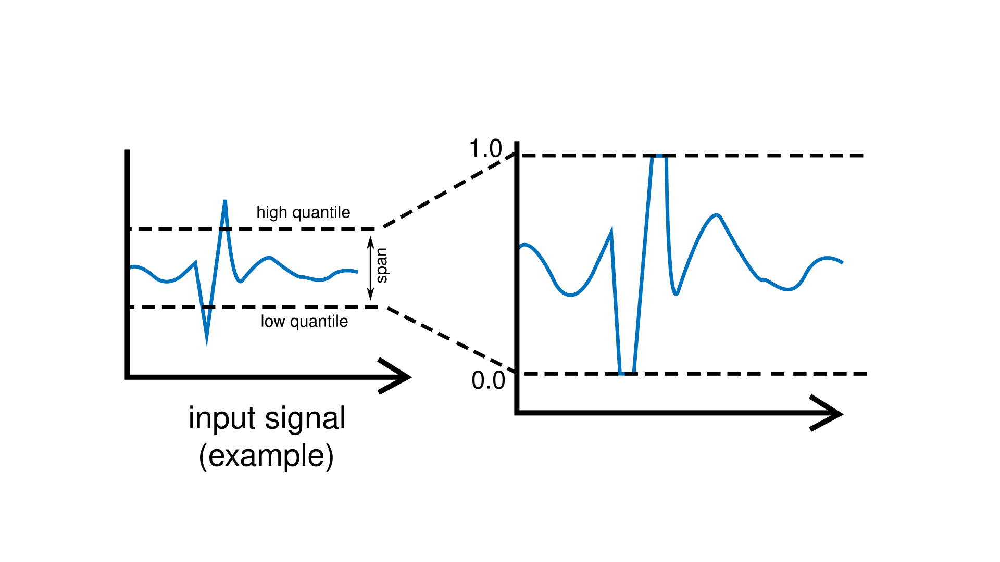
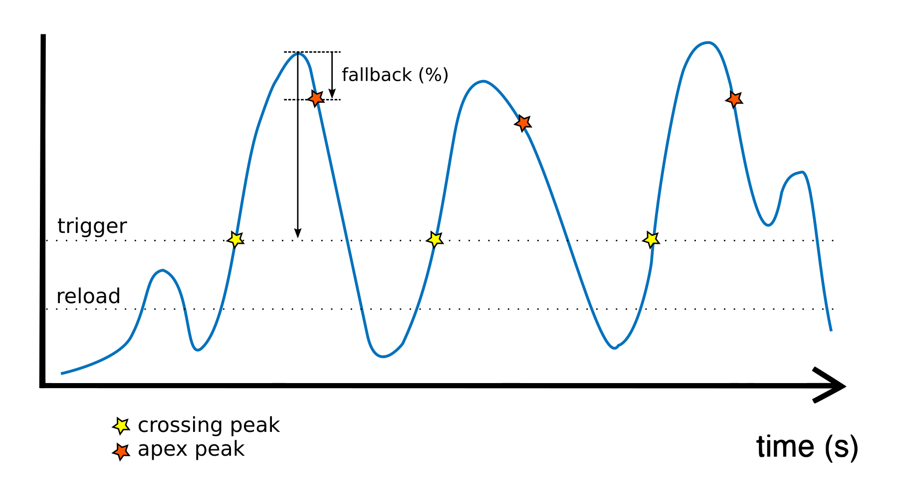

Regularizing Signals
====================

Plaquette provides expressive, automated, and robust ways to deal with signals
for interactive design using **regularization filters** such as smoothing,
min-max scaling, and normalization.

Direct Input-to-Output
----------------------

Let's review briefly how to handle raw :doc:`input and output <inputs_outputs>` signals in Plaquette.
We will be using an analog sensor such as a photoresistor for this example.

.. note::
  In order to build this circuit, you will need to create a simple
  `voltage divider circuit <https://learn.sparkfun.com/tutorials/voltage-dividers>`__.
  Connect the photoresistor between the ground (GND) and the analog input pin (``A0``). Then connect
  a fixed resistor with value matching your photoresistor between analog input pin and +5V (Vcc).
  For example, for a 1k :math:`\Omega` - 10k :math:`\Omega` photoresistor you could use a fixed
  resistor of about 5.5k :math:`\Omega`).

  .. image:: images/Plaquette-CircuitVoltageDivider.png
      :align: center

Here is a basic Arduino sketch that allows changing the value of an output LED using an input photocell:

.. code-block:: c++

   // The photocell analog pin.
   int photoCellPin = A0;

   // The output analog LED pin.
   int ledPin = 9;

   void setup() {
     // Initialize pins.
     pinMode(photoCellPin, INPUT);
     pinMode(ledPin, OUTPUT);
   }

   void loop() {
     // Read value from photocell (between 0 and 1023).
     int value = analogRead(photoCellPin);

     // Write value to LED (between 0 and 255).
     analogWrite(ledPin, value / 4);
   }

As explained in :doc:`why_plaquette` section, this code forces the programmer needs to
remember low-level information concerning the ranges of raw number values (1023, 255, ...)
Furthermore, it fails to adapt to changing conditions such as the range of the ambient light,
which might evolve over the course of the day.

Let's see how Plaquette can help us to create more expressive code by using inputs and
outputs signals rather than meaningless raw numbers.

To begin, we will re-implement the example above using Plaquette units.

First, let's define our input photocell on pin ``A0`` using an :doc:`AnalogIn` unit:

.. code-block:: c++

  AnalogIn photoCell(A0);

Then, let's add an output analog LED on pin `9` using an :doc:`AnalogOut` unit:

.. code-block:: c++

  AnalogOut led(9);

If we want to directly control the value of the LED from the value of the
photocell, all we need to do is to send the photocell's value to the led. The
easiest way to do so is by using the :doc:`>> <flow>` operator:

.. code-block:: c++

   photoCell >> led;

The complete Plaquette code looks like this:

.. code-block:: c++

   #include <Plaquette.h> // include the Plaquette library

   // Create input unit for photocell.
   AnalogIn photoCell(A0);

   // Create output unit for LED.
   AnalogOut led(9);

   void begin() {}

   // Define frame-by-frame operations.
   void step() {
     // Send photocell value directly to the LED.
     photoCell >> led;
   }

Getting the Full Range of a Signal
----------------------------------

If we run this program, we will likely notice that the LED brightness will not
span the full range from 0% to 100%. That's because depending on ambient lighting
conditions, the photocell's values will not move across the full spectrum of
possibility. For instance, in the dark, the photocell might range from 10% to 50%,
while in full daylight, it might range between 70% and 95%.

In order to resolve this issue, we need to **regularize** the photocell's signal.
We can do so using a filtering unit such as a :doc:`MinMaxScaler`. This unit automatically
keeps track of the minimum and maximum values of the incoming signal over time
(for example, 10% and 50%) and remaps them into a new interval of [0, 1] (ie., 0% to 100%).

.. image:: images/Plaquette-MinMaxScaler.png

To use this approach, create the unit:

.. code-block:: c++

   MinMaxScaler regularizer;

... and then *insert it* in the pipeline between the incoming photocell signal and
the output LED:

.. code-block:: c++

   photoCell >> regularizer >> led;

The above expression will do the following, in order:

 #. Read the raw photocell value using the ``photoCell`` unit.
 #. Send that raw value from the ``photoCell`` unit to the ``regularizer`` unit.
 #. The ``regularizer`` unit updates itself if the value is a new extreme value (minimum or maximum).
 #. The ``regularizer`` then remaps the raw photocell value to the full range of [0, 1] and sends it to the ``led`` unit.
 #. The ``led`` unit takes the input value in [0, 1] and applies it to the intensity of the LED.

Handling Noisy or Unpredictable Signals
---------------------------------------

The :doc:`MinMaxScaler` is great when your signal behaves in a fairly stable way. It
learns the smallest and largest values it has ever seen, then stretches everything
into a clean [0, 1] range. However, some sensors behave in a much more irregular way.
They might produce short spikes, sudden jumps, or occasional “glitches.” These rare
events can throw off the MinMaxScaler by forcing it to update its minimum or maximum
too aggressively.

For such situations, Plaquette provides the :doc:`RobustScaler`. Instead of focusing
on *extreme* values, the RobustScaler concentrates on what the signal is doing *most
of the time*. It keeps track of a "typical low" and a "typical high" value, ignoring
rare spikes, and maps the signal between 0 and 1 based on this typical span.

You can create a RobustScaler the same way as a MinMaxScaler:

.. code-block:: c++

   RobustScaler regularizer;

Then:

.. code-block:: c++

   void step() {
     photoCell >> regularizer >> led;
   }

The output still stays within [0, 1], but the regularizer behaves more calmly and is
less affected by sudden unexpected events.

If needed, you can adjust how tolerant it is to spikes by setting its ``span()``. A
larger span makes it more robust but also clamps extreme values more strongly. A
smaller span makes it more sensitive but less stable.

Reacting to Signal Changes
--------------------------

Remember our example from :doc:`ealier <why_plaquette>`, where we were trying to detect high-valued
signals using arbitrary numbers?

.. code-block:: c++

   if (value > 716)
     // do something

Suppose that instead of directly controlling the LED value based on the photocell's
value, we instead want to use sudden changes in the photocell's value to
trigger the on/off state of the LED? In other words, we would like to work with the **peaks** in the
incoming signal (such as when someone points a light source towards the photocell).

One way to do so would be to pick a threshold in the regularized signal
above which we would react to the light source. Let's say that we will react
when the signal goes above 70%. The code of the ``step()`` function now
becomes:

.. code-block:: c++

    void step() {
      photoCell >> regularizer;
      if (regularizer > 0.7)
        1 >> led;
      else
        0 >> led;
    }

... which can be more compactly rewritten by sending directly the conditional
expression ``(regularizer > 0.7)`` to the output LED:

.. code-block:: c++

    void step() {
      photoCell >> regularizer;
      (regularizer > 0.7) >> led;
    }

Adapting to Changing Conditions
-------------------------------

So far so good. The number 0.7 is still a bit of an arbitrary, hand-picked number, but it makes
more sense than 716 because it refers to a more human-understandable concept
(70% instead of 716 / 1023). However, this approach will still be sensitive to changes in
the ambient light, and behave differently under different light conditions (for example, it might
work as expected in the morning, but work less well in the late afternoon when the sun starts to go down.)

One thing we could do would be to make sure that our regularization unit adapts
to changing conditions. In order to do this, rather than having our MinMaxScaler
remap values depending on every single incoming value, we can have it
adapt over a **time window**. This will allow our regularizer to slowly forget
what it has learned, and reprogram itself after a certain amount of time has passed.

This can be accomplished by calling the ``timeWindow(seconds)`` function inside
the ``begin()`` function:

.. code-block:: c++

   void begin() {
     // Allow regularizer to adapt over an approximate period of 1 hour (3600 s).
     regularizer.timeWindow(3600.0f);
   }

Normalizing Signals to Spot Extreme Values
------------------------------------------

The MinMaxScaler is a very useful unit for making sure signals stay within a
[0, 1] range. However, it is not always the best for signal detection since it
only accounts for extreme values (minimum and maximum), which makes it sensitive
to rare events. Someone switching the lights on and off again rapidly might completely
ruin the show.

A better alternative is the :doc:`Normalizer` unit, which regularizes incoming signals
by normalizing them around a target **mean** by taking into account **standard deviation**.
Once the data is normalized, extreme **outlier** values can be more easily and robustly detected
based on how much they diverge from the mean.

Let's replace our MinMaxScaler by a Normalizer unit:

.. code-block:: c++

   Normalizer regularizer;

... and use the ``isHighOutlier()`` function to find values that are higher
than usual:

.. code-block:: c++

    void step() {
      photoCell >> regularizer;
      regularizer.isHighOutlier(photoCell) >> led;
    }

.. tip::
  By default, the ``isHighOutlier()`` function detects values that are more than
  1.5 deviations from the mean. The function can be made more or less sensitive by
  adjusting the number of deviations (typically between 1.0 and 3.0). For example,
  ``isHighOutlier(value, 1.2)`` will be more sensitive,
  ``isHighOutlier(value, 2.5)`` will be less sensitive, and ``isHighOutlier(value, 3.0)``
  will only respond to rarely-occuring extremes. While these numbers (1.2, 1.5, 2.5, etc.)
  still need to be hand-picked, they are much more robust than our 716 and even to
  our 0.7 number from earlier.

Here is a complete version of the code:

.. code-block:: c++

   #include <Plaquette.h> // include the Plaquette library

   // Create input unit for photocell.
   AnalogIn photoCell(A0);

   // Create output unit for LED.
   AnalogOut led(9);

   // Create regularization object.
   Normalizer regularizer;

   // Initialize everything.
   void begin() {
     // Allow regularizer to adapt over an approximate period of 1 hour (3600 s).
     regularizer.timeWindow(3600.0f);
   }

   // Define frame-by-frame operations.
   void step() {
     // Update regularizer with raw signal value.
     photoCell >> regularizer;

     // Detect outliers and send the value (1=true=outlier, 0=false=no outlier)
     // directly to the LED.
     regularizer.isHighOutlier(photoCell) >> led;
   }

Choosing the Right Regularizer for the Job
------------------------------------------

In creative media, each regularizer offers a different way of interpreting the same
signal. A simple way to choose between them is to think about the kind of behaviour
you want:

- Use **MinMaxScaler** when you want to **use the full expressive range** of the
  signal exactly as it occurs. It is a good choice when the signal’s lowest and
  highest values are *meaningful* (not accidental glitches), and when you want
  outliers to have a noticeable effect. This makes it ideal for direct mappings
  where the natural span of the sensor should translate into the full motion of a
  parameter such as brightness, speed, position, or size.

- Use **RobustScaler** when you want **stable behaviour** even in the presence of
  noise, glitches, or unpredictable input. It focuses on the “typical” range of the
  signal and ignores rare spikes, making it suitable for real-world sensors with
  variability, jitter, or unpredictable environmental conditions.

- Use **Normalizer** when you want to understand **how far the signal deviates
  from its typical behaviour**, rather than how big or small it is in absolute
  terms. This is useful for detecting unusual events, bursts of activity, or
  expressive gestures that stand out relative to the usual pattern of the sensor.

Thinking about your signal in terms of **expressive range**, **stability**, or
**deviation** will help you select the regularizer that best supports the
interaction you are designing.

The table below summarizes when and why you would use each unit, and gives examples
of typical signals where each is a good fit.

.. list-table::
   :header-rows: 1
   :widths: 10 30 30 30

   * - Regularizer
     - Best Used When ...
     - Pros & Cons
     - Example Signals

   * - :doc:`MinMaxScaler`

     - Your signal has **clear, stable limits** and you want to remap it
       cleanly into the full **[0, 1]** range, often for direct control
       (sensor → brightness, speed, position, etc.).

     - **Pros:**

       - Very simple and intuitive
       - Great for direct, continuous mappings
       - Easy to reason about visually (“full sweep = 0% to 100%”)

       **Cons:**

       - Very sensitive to spikes and rare extreme values (outliers)
       - Sudden glitches can distort the usable range

     - - Photocells in controlled lighting
       - Distance sensors with bounded ranges
       - Knobs, sliders, faders
       - Flex sensors over limited movement arcs

   * - :doc:`RobustScaler`

     - Your signal is **noisy, erratic, or unpredictable**, and you want
       a stable result even when rare spikes occur. You care more about
       the “typical” range than about extremes.

     - **Pros:**

       - Tolerant to outliers
       - Ignores occasional glitches
       - Produces a stable [0, 1] range
       - ``span()`` adjusts robustness vs. sensitivity

       **Cons:**

       - Very extreme values may be clamped
       - Adapts more slowly than MinMaxScaler

     - - Physiological / biosignals (heart-rate, EMG, GSR, EEG amplitude)
       - Noisy microphones or piezo discs
       - Jittery accelerometers
       - Environmental sensors in public spaces

   * - :doc:`Normalizer`

     - You want to understand a signal in terms of **how much it differs from its
       own average behaviour**. Works best when the signal naturally clusters around
       a single central value (a “bell-shaped” or roughly normal distribution).

     - **Pros:**

       - Provides a clear measure of relative deviation from the mean
       - Tolerant to outliers
       - Very effective for identifying outliers or unusual events

       **Cons:**

       - Output is not limited to [0, 1]
       - Less suited for direct sensor → output mappings
       - Can be misleading for signals with multiple distinct operating states (e.g., empty room vs. crowded room)

     - - Photocells where the goal is to detect departures from normal light levels
       - Microphones used to detect unusual loudness relative to ambient noise
       - Motion sensors where gestures stand out against small baseline movement

Detecting Peaks
---------------

The outlier detection method is useful to find extreme values. However, it also
comes with an important limitation. The ``isHighOutlier()`` and ``isOutlierLow()``
methods return ``true`` *as long as* the received value is considered to be an
outlier, making these methods unsuitable for triggering instantanous events, such as
toggling the status of an LED, starting a sound event, activating a motor, etc.

The :doc:`PeakDetector` unit addresses this limitation. It is best used in combination
with a Normalizer unit. We will use the default mode of the PeakDetector (``PEAK_MAX``):
for a peak to be detected. In this mode, the signal will need to (1) cross a *trigger threshold* value
(``triggerThreshold``); (2) reach its *apex* (max); and (3) *fall back* by a certain
proportion (%) between the threshold and the apex (controlled by the ``fallbackTolerance``
parameter).

Building on the previous section for outlier detection, we will assign the PeakDetector's
``triggerThreshold`` to the value above which a value is considered to be a high outlier,
which can be obtained by calling the Normalizer's function ``highOutlierThreshold()``:

.. code-block:: c++

    PeakDetector detector(normalizer.highOutlierThreshold());

.. tip::

  As for the ``isHighOutlier()`` function, the ``highOutlierThreshold()`` function
  is set to return, by default, a threshold that is 1.5 standard deviations from the mean. The
  function can be made more or less sensitive by adjusting the number of deviations.
  For example, ``highOutlierThreshold(1.2)`` will be more sensitive, while
  ``highOutlierThreshold(2.5)`` will be less sensitive.

Finally, let's rewrite the ``step()`` function with our new peak detector, so
that only when a **peak** is detected will the LED change state:

.. code-block:: c++

    void step() {
      // Signal is normalized and sent to peak detector.
      sensor >> normalizer >> detector;

      // Toggle LED when peak detector triggers.
      if (detector)
        led.toggle();
    }

The PeakDetector unit offers many options to fine-tune the peak detection process.
Please read the :doc:`full documentation of the unit <PeakDetector>` for details.

Conclusion
----------

The Plaquette library simplifies signal processing for interactive design by abstracting low-level
details and offering intuitive regularization tools like :doc:`MinMaxScaler` and :doc:`Normalizer`.
Combined with :doc:`PeakDetector` opens the way to deploy precise event-driven behaviors.

Plaquette's ability to adapt to changing conditions ensures dynamic, robust systems while keeping code
concise and expressive. By leveraging its modular architecture, users can streamline signal
handling, improve scalability, and focus on innovation in signal-driven creative applications.
