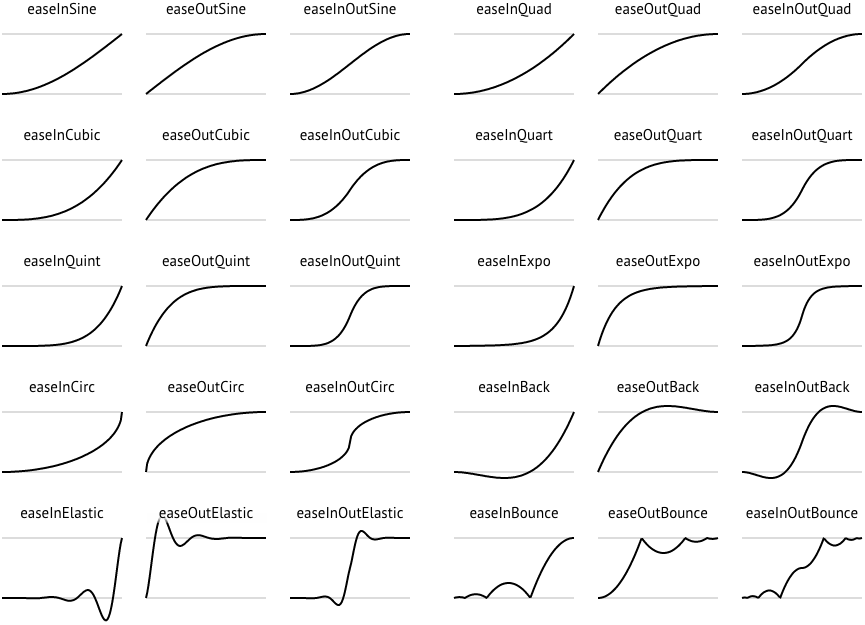

=================
Working with Time
=================

In interactive systems, **timing** plays a crucial role in controlling the flow of events. Whether
you are counting time, triggering events, or generating periodic signals, Plaquette provides
powerful tools to manage time effectively. In this section, we will explore timing functions and
units, such as :doc:`seconds`, :doc:`Chronometer`, :doc:`Alarm`, :doc:`Metronome`, and :doc:`Ramp`.

Timing is the backbone of interactive systems. By understanding and leveraging Plaquette's timing tools,
you can create precise, dynamic, creative projects that respond in real-time to various inputs and conditions.

.. note::
  To follow along with the examples, set up a simple circuit:

  - A **potentiometer** connected to ``A0`` to control proprties dynamically.
  - A **button** connected to pin ``2`` with an internal pull-up resistor to trigger actions.
  - An **LED** connected to pin ``9`` (PWM capable) through a 330 :math:`\Omega` resistor.

  It is strongly advised to use the `Serial Plotter <https://docs.arduino.cc/software/ide-v2/tutorials/ide-v2-serial-plotter/>`__
  to visualize the signals.

.. warning::

    The value returned by timing units and functions are approximations. They are good enough for most creative applications. They should,
    however, not be used as a substitute for a real-time clock in applications requiring high precision, especially over long
    periods of time. For example, on an Arduino Uno, a drift may be experienced of up to 10 seconds per hour, or 5 minutes per day.

Measuring Absolute Time with seconds()
--------------------------------------

The most fundamental timing functionality in Plaquette is the :doc:`seconds` function. As its name suggests,
it simply returns the elapsed time in seconds `since the program started running`. This is very useful for measuring
durations or triggering time-based events.

**Example**: Turn LED off after 3 seconds, then on again after 10 seconds.

.. code-block:: cpp

    #include <Plaquette.h>

    DigitalOut led(LED_BUILTIN);

    void begin() {
      led.on();
    }

    void step() {
      if (seconds() >= 3) { // After 3 seconds: turn LED off
        led.off();
      } else if (seconds() >= 10) { // After 10 seconds: turn LED on
        led.on();
      }
    }

While :doc:`seconds` provides a simple and effective way to measure time, it is inherently limited in scope. It measures only
the elapsed time since the program started, functioning as a continuously increasing global counter that cannot be reset or adapted
for specific events. This makes it inflexible when we need to measure time between arbitrary points or manage multiple independent
timing events. For precise control and event-specific timing operations such as starting, stopping, resetting, or tracking multiple
durations simultaneously, we need more refined timing instruments.

Timing Units
------------

Plaquette offers a core set of specialized units to simplify common timing tasks:

- :doc:`Chronometer`: Measures elapsed time between events
- :doc:`Alarm`: Activates after a specific duration
- :doc:`Metronome`: Generates periodic pulses
- :doc:`Ramp`: Creates smooth transitions

.. danger::
  Timing units deal with time and events without interrupting the main processing loop.
  Users should avoid blocking processes such as
  `delay() <https://docs.arduino.cc/language-reference/en/functions/time/delay/>`__ and
  `delayMicroseconds() <https://docs.arduino.cc/language-reference/en/functions/time/delayMicroseconds/>`__ and
  when using Plaquette.

Let us dive into these units and see what each one of them has to offer.

Keeping Track of Time with Chronometer
--------------------------------------

While :doc:`seconds` can only give you the time since the start of the program, the :doc:`Chronometer` unit
allows you to measure the time elapsed since it was started, like a real-life stopwatch. It is your basic
building block for creating responsive systems where timing matters.

Chronometers are particularly useful for scenarios where the duration of an action determines its
outcome. For instance, measuring how long a button is pressed can enable a system to interpret
short and long presses differently.

**Example**: Changes LED intensity depending on how long button was pressed.

.. code-block:: cpp

    #include <Plaquette.h>

    DigitalIn button(2, INTERNAL_PULLUP); // Button input
    AnalogOut led(9); // LED output
    Chronometer chrono; // Chronometer measuring button press duration

    void begin() {
      button.debounce(); // Debounce button
      led.off();
    }

    void step() {
      if (button.rose()) {
        chrono.start(); // Start the timer when button is pressed
      }

      else if (button.fell()) {
        // Converts chronometer time to LED intensity over a range of 10 seconds
        float ledValue = mapTo01(chrono, 0, 10); // Maps from 0-10 seconds to [0, 1] range
        ledValue >> led;
        chrono.stop(); // Stops/resets the timer when button is released
      }

      println(chrono); // Prints value of chrono for visualization.
    }

The :doc:`Chronometer` is great for counting time. In many scenarios, however, you want to know whether you waited
for a certain amount of time. The :doc:`Alarm` unit provides a convenient way to do so.

Scheduling with Alarm
---------------------

Like a real-world alarm-clock, the :doc:`Alarm` unit starts "buzzing" after a predefined time. This
**digital unit** is initialized with a certain duration. It outputs 0/false until it reaches its timeout;
then, it starts "ringing" and outputs 1/true until it is stopped or restarted.

Once triggered, it can be stopped by calling its ``stop()`` function, or restarted by calling ``start()``,
making the unit ideal for implementing delayed responses or timed sequences.

Alarms can help manage actions that require specific timing, such as turning off a light after a
certain duration or triggering an animation. Their flexibility makes them a powerful tool in time-
based designs.

**Example**: Starts blinking an LED when we reach the alarm's timeout. Pushing the button restarts
the alarm, increasing its duration by 50% each time.

.. code-block:: cpp

    #include <Plaquette.h>

    DigitalOut led(LED_BUILTIN); // LED on built-in pin
    DigitalIn button(2, INTERNAL_PULLUP); // Button input

    SquareWave blink(0.5); // Wave to blink LED when alarm is buzzing

    Alarm alarm(2.0); // Alarm with 2s duration

    void begin() {
      button.debounce(); // Debounce button
    }

    void step() {
      // Button: restart.
      if (button.rose()) {  // Button pressed event
        led.off();          // Turn off LED
        alarm.duration( alarm.duration() * 1.5 ); // Increase duration by 50%.
        alarm.start();      // Start alarm
      }

      // Alarm buzzing: blink LED.
      if (alarm) {    // Check if alarm is buzzing
        blink >> led; // Blink LED
      }

      println(alarm.progress()); // % progress of the alarm (for visualization)
    }

Triggering Periodic Events with Metronome
-----------------------------------------

While the :doc:`Alarm` unit is great for dealing with one-time events, there are many cases
where an action needs to be triggered periodically. For such use cases, Plaquette provides the
:doc:`Metronome` unit which sends a periodic pulse or "bang". In other words, it acts like an
:doc:`Alarm` that gets restarted as soon as it starts buzzing. It also bears some resemblance
with :doc:`wave units <waves>`.

Periodic actions are at the core of interactive systems, whether you are blinking an LED or
synchronizing motor movements. The :doc:`Metronome` provides a straightforward way to create these
kinds of repetitions.

**Example**: Blink an LED using a Metronome:

.. code-block:: cpp

    #include <Plaquette.h>

    DigitalOut led(LED_BUILTIN); // LED on built-in pin
    Metronome metro(1.0); // Metronome with period of 1 second

    void begin() {}

    void step() {
      if (metro) { // The unit will be true for a single frame every time it triggers
        led.toggle(); // Toggle LED on each pulse
      }
    }

Metronome units can be used as a way to trigger different actions in parallel.

**Example**: Use multiple :doc:`Metronome` units to control different actions. One metronome
toggles LED visibility, while another slower metronome accelerates blinking speed at each tick.

.. code-block:: cpp

    #include <Plaquette.h>

    DigitalOut led(LED_BUILTIN); // LED on built-in pin
    SquareWave blink(1.0); // Wave to blink the LED
    Metronome metroToggle(2.0); // Metronome to toggle visibility
    Metronome metroAccelerate(10.0); // Metronome to accelerate blink

    boolean visible = true; // Flag to keep track of visibility

    void begin() {}

    void step() {
      // Toggle visibility.
      if (metroToggle) {
        visible = !visible; // Invert boolean value
      }

      // Accelerate blink.
      if (metroAccelerate) {
        blink.frequency( blink.frequency() * 2 ); // Double frequency
      }

      // Activate LED depending on visibility status.
      if (visible)
        blink >> led;
      else
        led.off();
    }

Creating Smooth Transitions with Ramp
-------------------------------------

Ramps are a cornerstone of creative expression. Unlike oscillators like :doc:`TriangleWave` and :doc:`SineWave`,
which generate periodic signals, ramps interpolate from one value to another over a specific duration or at a
specific speed. The :doc:`Ramp` unit in Plaquette provides a flexible and powerful way to animate visual
elements such as LEDs or physical components such as motors in a natural manner, allowing the creation of rich,
dynamic, evolving experiences.

.. tip::
  We strongly recommend to use the Serial Plotter to visualize the ramp values in the following examples.

Basic Usage
~~~~~~~~~~~

Like :doc:`Alarm` units, ramps can be restarted by calling their ``start()`` function. By default, they
will ramp between 0 and 1.

**Example**: Gradually increases an LED brightness over 5 seconds every time a button is pressed.

.. code-block:: cpp

    #include <Plaquette.h>

    DigitalIn button(2, INTERNAL_PULLUP); // Button input
    AnalogOut led(9); // LED output
    Ramp ramp(5.0);   // Ramp with 5 seconds duration

    void begin() {
      button.debounce(); // Debounce button
      ramp.start(); // Initial ramp startup
    }

    void step() {
      if (button.rose()) {
        ramp.start(); // Restart ramp
      }

      ramp >> led; // Use ramp value to control LED brightness
      println(ramp); // Visualize ramp value with the Serial Plotter
    }

Try changing the behavior of the ramp to rather go from 1 to 0 by calling the ``fromTo()`` function
and see how that changes the behavior of the ramp:

.. code-block:: cpp

    void begin() {
      ramp.fromTo(1.0, 0.0); // Ramp from one to zero
      ramp.start();
    }

Flexible Ranges
~~~~~~~~~~~~~~~

Ramps are not restricted to the range [0, 1]. You can define any starting and ending values,
making ramps very useful for various applications such as changing properties of waves, controlling the
angle of a servo motor, adjusting the color of a RGB LED, etc.

**Example**: Gradually increases an LED brightness over a 5 seconds period every time a button is pressed.
The potentiometer sets the maximum LED value to attain.

.. code-block:: cpp

    #include <Plaquette.h>

    DigitalIn button(2, INTERNAL_PULLUP); // Button input
    AnalogIn pot(A0); // Potentiometer input
    AnalogOut led(9); // LED output
    Ramp ramp(5.0); // Ramp with 5 seconds duration

    void begin() {
      button.debounce(); // Debounce button
    }

    void step() {
      if (button.rose()) {
        ramp.to(pot); // Set ramp goal to value of potentiometer
        ramp.start(); // Restart ramp
      }

      ramp >> led; // Use ramp value to control LED brightness
      println(ramp); // Visualize ramp value with the Serial Plotter
    }

Try adjusting the potentiometer to different positions and then pressing the button to see the effect.

Notice how we are using function ``to()`` to set the goal of the ramp. The starting value is left
unchanged at zero (default value). To change the starting value while preserving the goal value, use
function ``from()`` instead. See what happens if you change the call ``ramp.to(pot)`` to use ``from()``
intead:

.. code-block:: cpp

        ramp.from(pot); // Set ramp goal to value of potentiometer

Dynamic Control with go()
~~~~~~~~~~~~~~~~~~~~~~~~~

A common scenario in creative applications is to respond to events by changing a value such as the
position of a servomotor, the color of a RGB LED, or the volume of a sound. Ramps are often used in
these cases to create smooth transitions instead of abrupt changes.

The ``go()`` function provides a simple way to immediately launch a ramp from one value to another,
or simply from the current value towards a new goal.

.. image:: images/Plaquette-Ramp.png

**Example**: Control blinking frequency using a button. Each time the button is pushed, a new frequency
is chosen randomly and the ramp smoothly goes to the new frequency.

.. code-block:: cpp

    #include <Plaquette.h>

    DigitalIn button(2, INTERNAL_PULLUP); // Button input
    AnalogOut led(9);  // LED output
    Ramp ramp(5.0);    // Ramp with 5 seconds duration
    TriangleWave wave; // Oscillator

    void begin() {
      wave.skew(1.0);   // Sawtooth wave
      wave.bpm(100);     // Initial BPM
      button.debounce(); // Debounce button
    }

    void step() {
      if (button.rose()) {
        // Set target BPM to random value
        float targetBpm = randomFloat(60, 200);
        ramp.go(targetBpm); // Launch ramp
      }

      wave.bpm(ramp); // Use ramp value to adjust BPM of wave

      wave >> led;   // Oscillate LED
      println(ramp); // Visualize ramp value with the Serial Plotter
    }

.. note::
  Ramps provide multiple ways to call ``go()`` depending on the desired behavior, including specifying
  starting value and duration on the spot. For more details, please consult the :doc:`Ramp unit's reference <Ramp>`.

Generating Expressive Effects with Easing Functions
~~~~~~~~~~~~~~~~~~~~~~~~~~~~~~~~~~~~~~~~~~~~~~~~~~~

:doc:`Ramp` supports :doc:`easing function <easings>`, providing many different ways to generate expressive
effects. Easing functions add acceleration or deceleration effects to ramp transitions, making
them feel more natural and lifelike.

**Example**: Use easing to create a smooth LED fade repeatedly:

.. code-block:: cpp

    #include <Plaquette.h>

    AnalogOut led(9); // LED output
    Ramp ramp(3.0); // Ramp with 3 seconds duration

    void begin() {
      ramp.easing(easeInOutQuad); // Apply an easing function
      ramp.start();
    }

    void step() {
      if (ramp.isFinished())
        ramp.start(); // Restart the ramp with the easing effect
      }

      ramp >> led;   // Use the ramp's value to control the LED brightness
      println(ramp); // Visualize ramp value with the Serial Plotter
    }

Try experimenting with different easing functions and observe the results on the LED and using the
Serial Plotter. Easing can transform mechanical transitions into expressive animations, giving your
projects character.

Operational Modes: Duration vs Speed
~~~~~~~~~~~~~~~~~~~~~~~~~~~~~~~~~~~~

By default, ramps transition between two values over a definite duration. However, there are
many scenarios where this is not the appropriate behavior. For example, one might want to move
a servomotor at a specific angular speed: ramping over 10 degrees should take much less time than
a 90 degrees transition.

Ramps accomodate these different use cases by providing two modes of operation:

- In **duration mode** (default) the ramp transitions between values over a fixed number of seconds.
- In **speed mode** the ramp moves at a constant rate, defined in value change per second.

**Example**: Compare duration and speed modes. Ramp values can be visualized using the
Serial Plotter.

.. code-block:: cpp

    #include <Plaquette.h>

    DigitalIn button(2, INTERNAL_PULLUP); // Button input
    Ramp rampDuration; // Ramp operating in duration mode
    Ramp rampSpeed;    // Ramp operating in speed mode

    void begin() {
      rampDuration.duration(5.0); // Duration: 5 seconds
      rampSpeed.speed(5.0); // Rate of change: 5 per second
      button.debounce(); // Debounce button
    }

    void step() {
      if (button.rose()) {
        // Both ramps go to random target value.
        float targetValue = randomFloat(-20, 20);
        rampDuration.go(targetValue);
        rampSpeed.go(targetValue);
      }

      // Visualize and compare ramps with the Serial Plotter
      print(rampWithDuration);
      print(" ");
      println(rampWithSpeed);
    }

.. tip::
  To switch between modes, you can simply call the ``duration(value)`` or ``speed(value)``
  functions with a target duration or speed (recommended). Alternatively, you can change mode by calling ``mode(RAMP_DURATION)``
  or ``mode(RAMP_SPEED)``, in which case the duration or speed will be computed based on the ramp's
  current properties (ie. duration/speed, starting, and target values).

Combining Timing Units
----------------------

Plaquette allows you to combine different timing units to achieve complex behaviors while keeping your workflow clear
and intuitive. For instance, you can use a :doc:`Metronome` to repeatedly trigger a :doc:`Ramp` or
synchronize multiple timing units.

**Example**: Use a Metronome to trigger a Ramp at regular intervals:

.. code-block:: cpp

    #include <Plaquette.h>

    Metronome metro(10.0); // Trigger every 10 seconds
    Ramp ramp(3.0);   // Ramp with 3 seconds duration
    AnalogOut led(9); // LED output

    void begin() {}

    void step() {
      if (metro) {
        ramp.start(); // Start the ramp each time the metronome triggers
      }

      ramp >> led; // Use the ramp's value to control the LED brightness
      println(ramp); // Stream the ramp's value for visualization
    }

Combining timing units unlocks an even greater range of creative possibilities. Use these tools to
design intricate behaviors, smooth transitions, and expressive animations in your projects.

Conclusion
----------

Timing is an essential aspect of creating interactive and dynamic systems, and Plaquette provides an
intuitive set of tools to make this process seamless. From measuring durations with the :doc:`Chronometer`,
to triggering events with the :doc:`Alarm`, generating rhythmic patterns with the :doc:`Metronome`,
and creating smooth transitions with the :doc:`Ramp`, each timing unit offers unique possibilities.

The flexibility of these tools allows for countless creative applications, whether you are developing
reactive systems, synchronizing events, or designing natural and expressive transitions. By combining
these units, you can build intricate behaviors that bring your projects to life.
