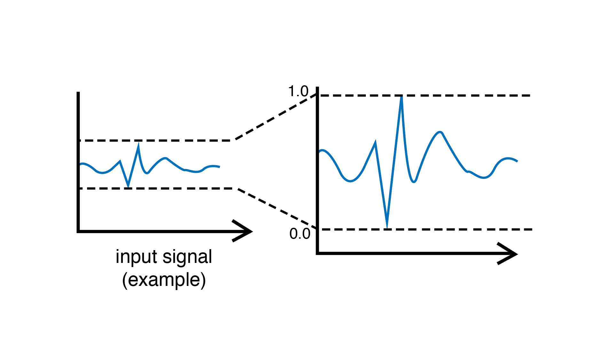

.. include:: defs.hrst

MinMaxScaler
============

This filtering unit regularizes incoming signals by remapping them into a new interval of [0, 1].
It does so by keeping track of the minimum and the maximum values ever taken by the signal and
rescales it such that the minimum value of the signal is mapped to 0 and the maximum value
is mapped to 1.

|Example|
---------

Reacts to high input values by activating an output LED. Scaler is used to
automatically adapt to incoming sensor values.

.. code-block:: c++

   #include <Plaquette.h>

   AnalogIn sensor(A0);

   MinMaxScaler scaler;

   DigitalOut led(13);

   void begin() {}

   void step() {
     // Rescale value.
     sensor >> scaler;

     // Light led on threshold of 80%.
     (scaler > 0.8) >> led;
   }

|Reference|
-----------

.. doxygenclass:: MinMaxScaler
   :project: Plaquette
   :members: MinMaxScaler, get, put

.. note::

   This filtering unit works well as long as there are no "outliers" in the signal (ie. extreme values)
   that appear in rare conditions. One way to prevent this is to smooth incoming values using the ``smooth()``
   method or a ``Smoother`` unit before sending to the ``MinMaxScaler``. Another approach is to use a
   regularization unit that is less prone to outliers such as the ``Normalizer`` or the ``AdaptiveNormalizer``.

|SeeAlso|
---------
- :doc:`AdaptiveNormalizer`
- :doc:`Normalizer`
- :doc:`Smoother`
