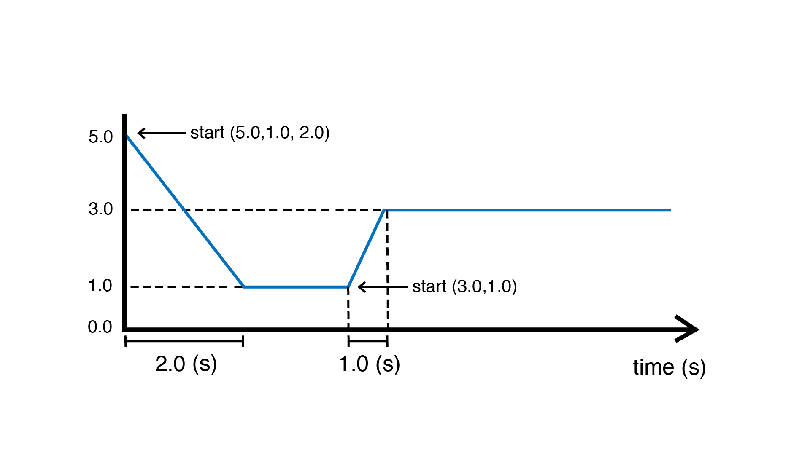

.. include:: defs.hrst

Ramp
====

A source unit that generates a smooth transition between two values. The unit can be
triggered to start transitioning to a target value for a certain duration.

There are two ways to start the ramp.

By calling ``start(from, to, duration)`` the ramp will transition from value ``from`` to
value ``to`` in ``duration`` seconds.

Alternatively, calling ``start(to, duration)`` will start a transition from the ramp's
current value to ``to`` in ``duration`` seconds.

This diagram shows what happens to the ramp signal if ``start(5.0, 1.0, 2.0)`` is
called, followed later by ``start(3.0, 1.0)``:

|Example|
---------

Sequentially ramps through different values.

.. code-block:: c++

   #include <Plaquette.h>

   Ramp myRamp(0.0); // the ramp is initalized at zero (0)

   StreamOut serialOut(Serial);

   void begin() {
   }

   void step() {
     if (myRamp.isComplete())
     {
       // Restarts the ramp going from current value to a random value in [-10, +10] in 2 seconds
       myRamp.start(randomFloat(-10, 10), 2.0);
     }

     myRamp >> serialOut;
   }

|Reference|
-----------

.. doxygenclass:: Ramp
   :project: Plaquette
   :members: Ramp, get, start, stop, resume, elapsed, progress, isStarted, isComplete, to, fromTo

|SeeAlso|
---------
- :doc:`Timer`
- :doc:`TriOsc`
