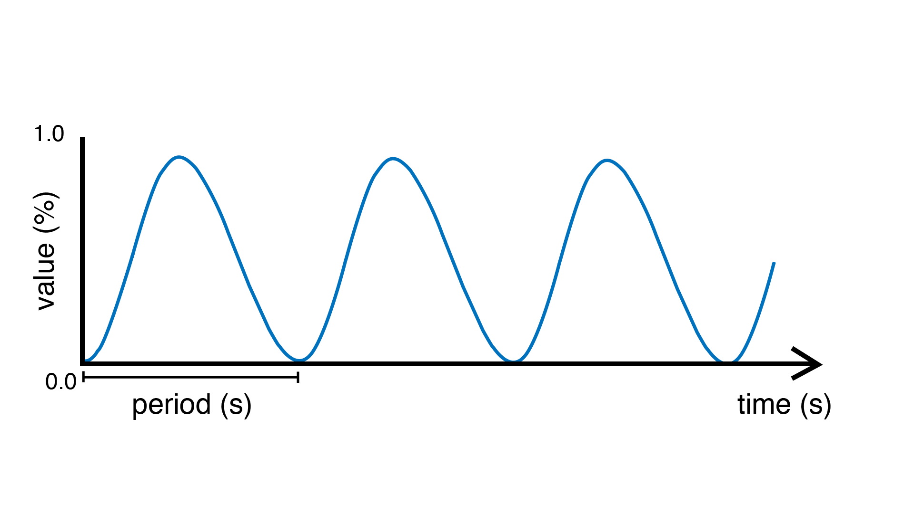

.. include:: defs.hrst

SineOsc
=======

A source unit that can generate a sinusoid or `sine wave <https://en.wikipedia.org/wiki/Sine_wave>`_.
The signal is remapped to oscillate between 0 and 1 (rather than -1 and 1 as
the traditional sine wave).

|Example|
---------

.. code-block:: c++

   AnalogOut led(9);

   SineOsc osc;

   void begin() {
     osc.frequency(5.0); // frequency of 5 Hz
   }

   void step() {
     osc >> led;
   }

.. doxygenclass:: SineOsc
   :project: Plaquette
   :members: SineOsc, period, frequency, get

|SeeAlso|
---------
- :doc:`SquareOsc`
- :doc:`TriOsc`
