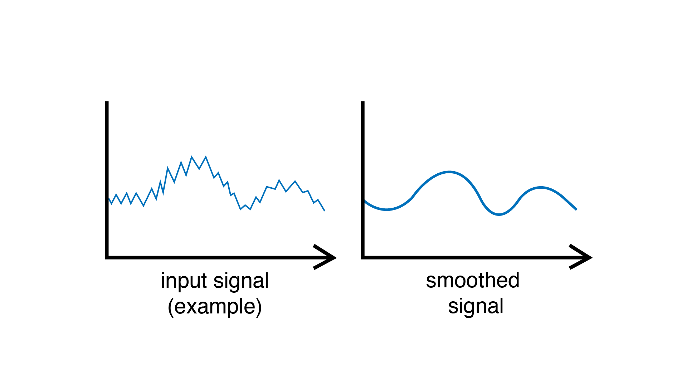

.. include:: defs.hrst

Smoother
========

Smooths the incoming signal by removing fast variations and noise (high frequencies).

|Example|
---------

Smooth a sensor over time.

.. code-block:: c++

   #include <Plaquette.h>

   AnalogIn sensor(A0);

   // Smooths over time window of 10 seconds.
   Smoother smoother(10.0);

   StreamOut serialOut(Serial);

   void begin() {}

   void step() {
     // Smooth value and send it to serial output.
     sensor >> smoother >> serialOut;
   }

.. note::
   The filter uses an `exponential moving average <https://en.wikipedia.org/wiki/Exponential_smoothing>`_
   which corresponds to a form of `low-pass filter <https://en.wikipedia.org/wiki/Low-pass_filter>`_.

|Reference|
-----------

.. doxygenclass:: Smoother
   :project: Plaquette
   :members: Smoother, get, put, cutoff, time

|SeeAlso|
---------
- :doc:`AnalogIn`
- :doc:`DigitalIn`
