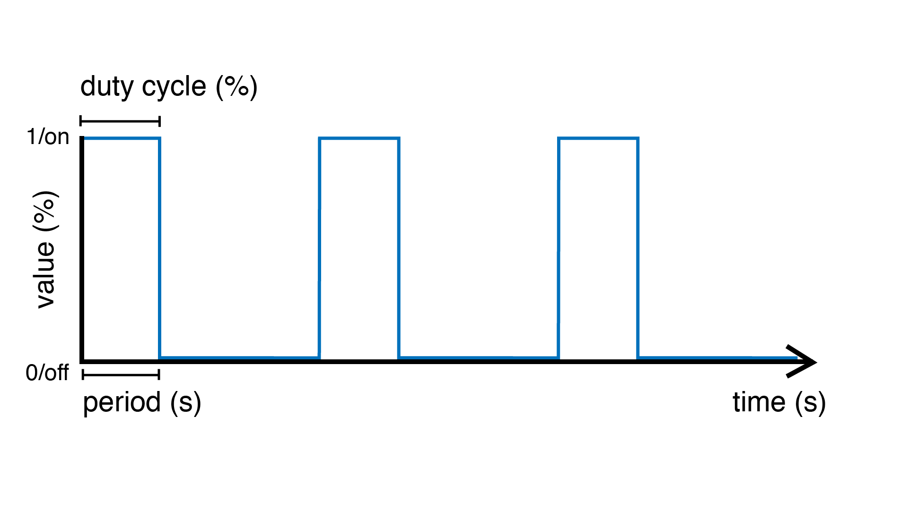
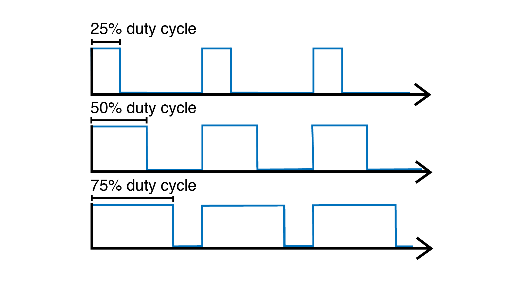

.. include:: defs.hrst

SquareOsc
=========

A source unit that generates a `square wave <https://en.wikipedia.org/wiki/Square_wave>`_
signal. The signal can be tuned by changing the ``period`` and/or ``frequency``
of the oscillation, as well as the ``duty cycle``.

The duty cycle represents the proportion of time (expressed as a percentage) in each
cycle (period) during which the wave is "on".

|Example|
---------

Makes the built-in LED blink with a period of 4 seconds. Because the duty cycle
is set to 25%, the LED will stay on for 1 second and then off for 3 seconds.

.. code-block:: c++

   #include <Plaquette.h>

   DigitalOut led(13);

   SquareOsc blinkOsc(4.0);

   void begin() {
     blinkOsc.dutyCycle(0.25); // Sets the duty cycle to 25%
   }

   void step() {
     blinkOsc >> led;
   }

.. doxygenclass:: SquareOsc
   :project: Plaquette
   :members: SquareOsc, period, frequency, phase, amplitude, dutyCycle, getInt, get

|SeeAlso|
---------
- :doc:`SineOsc`
- :doc:`TriOsc`
